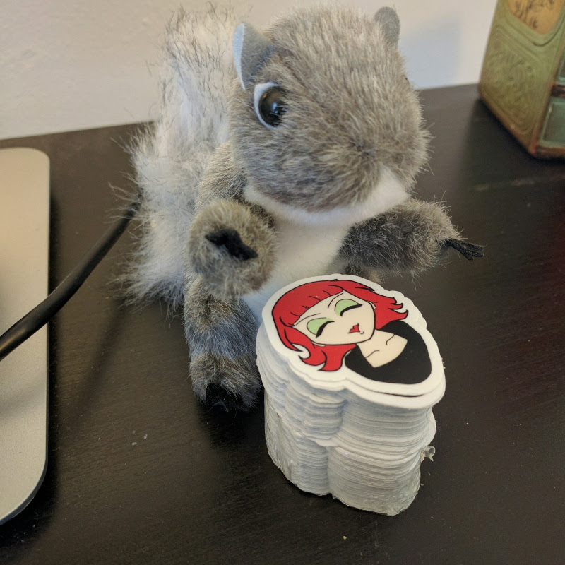
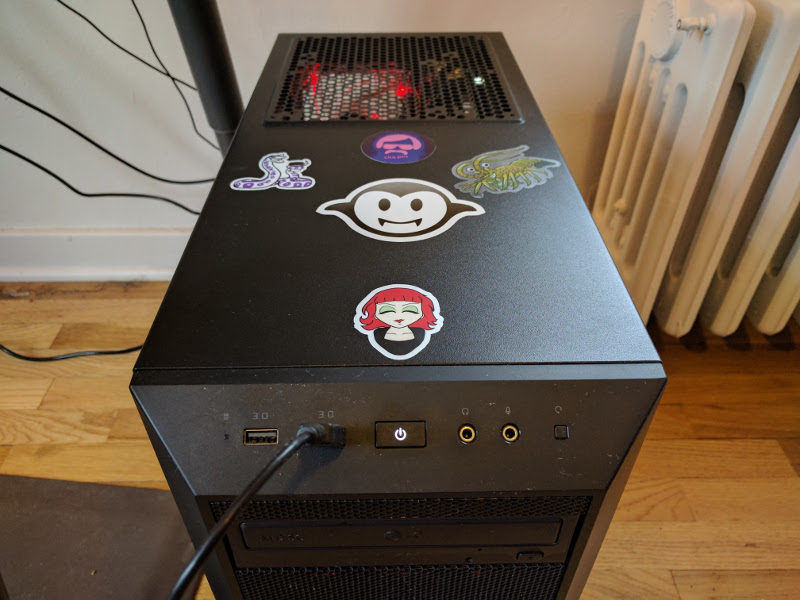

+++
title = "Chibi Rainyday Superstar"
date = "2016-09-01 00:00:00-07:00"
draft = false
aliases = [ "/craft/2016/chibi-rainyday-superstar/", "/2016/09/01/chibi-rainyday-superstar/", "/post/2016/09/chibi-rainyday-superstar/",]

[taxonomies]
category = [ "post",]
tags = [ "drawing", "portrait", "Sketchbook Mobile", "buy me", "craft",]

[extra]
card = "social_card.webp"

[extra.cover_image]
caption = ""
path = "cover.png"

+++

I was so unhappy with my attempts to draw realistic pictures of my
friend Rainy that I went in the complete opposite direction and drew her
in sort of a [chibi](https://en.wikipedia.org/wiki/Chibi_\(term\))
style.

This was the starting photo, if you’re curious.

I liked Chibi Rainy enough that I made a small order from [Sticker
Mule](https://www.stickermule.com/).

Of course Rainy gets the place of prominence on my computer.

Most of the stickers were given to her friends, who put them in all
sorts of interesting places. Restaurants, guitars, and random walls.
I’ll post a few of them when I have a little more time.