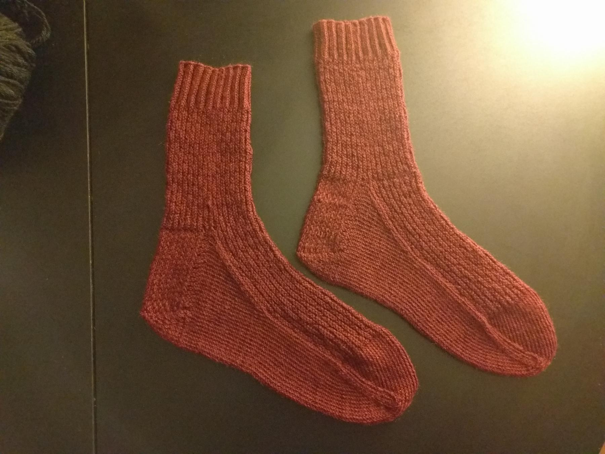

+++
title = "Mom's Stansfield 12 Socks"
date = "2016-02-07 00:00:00-08:00"
draft = false
aliases = [ "/craft/2016/moms-stansfield-12-socks/", "/2016/02/07/moms-stansfield-12-socks/", "/post/2016/02/moms-stansfield-12-socks/",]

[taxonomies]
category = [ "post",]
tags = [ "knitting", "socks", "craft",]

[extra.cover_image]
caption = "all pretty and about to go in the gift bag"
path = "cover.jpg"

+++

After more than ten years knitting, I finally had enough confidence in
my ability to make something for Mom.

This time I blocked the socks flat, and I think that helped them look
better when I wrapped them up for shipping.

