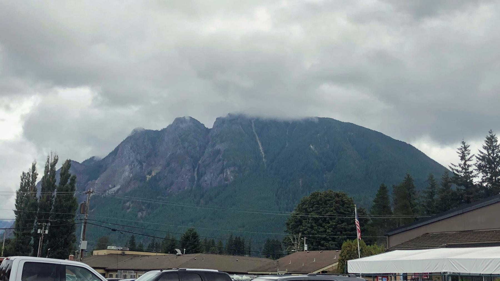
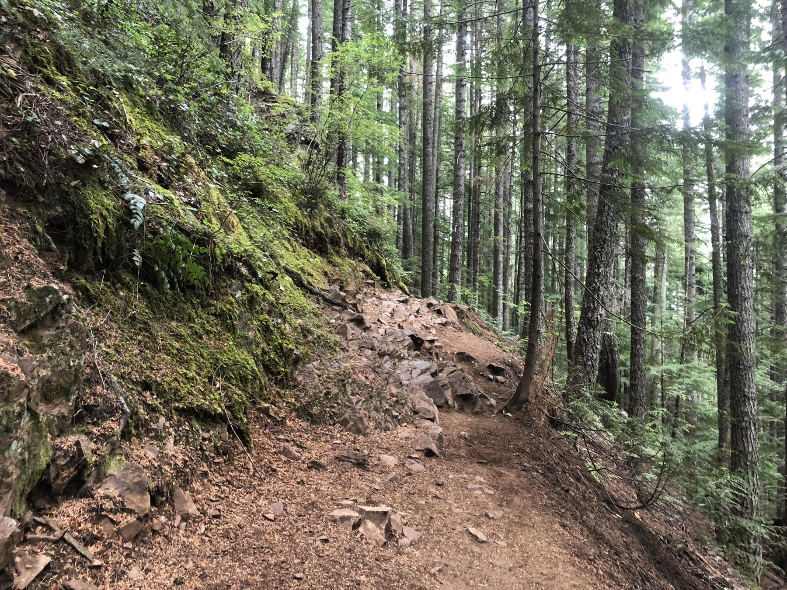
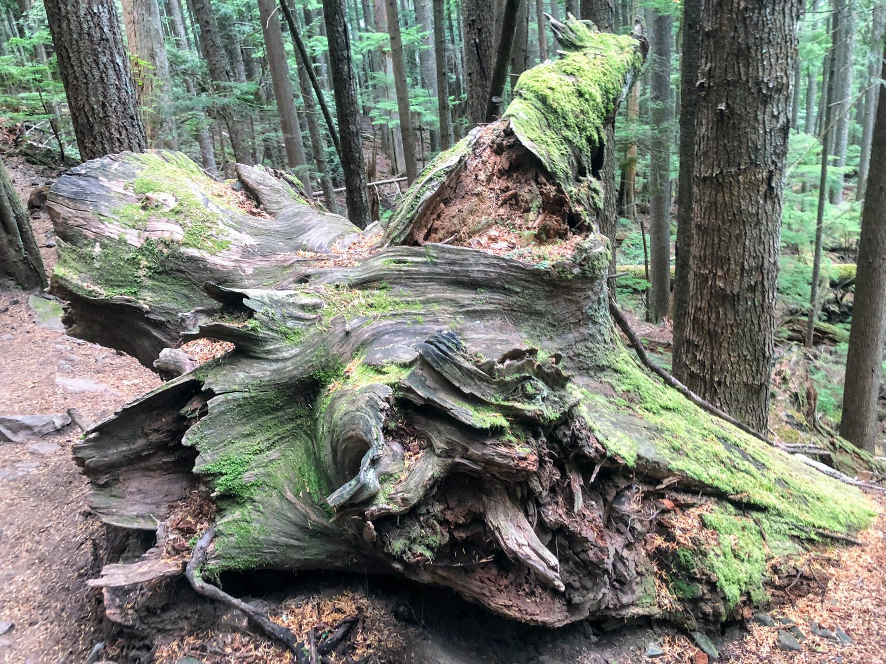
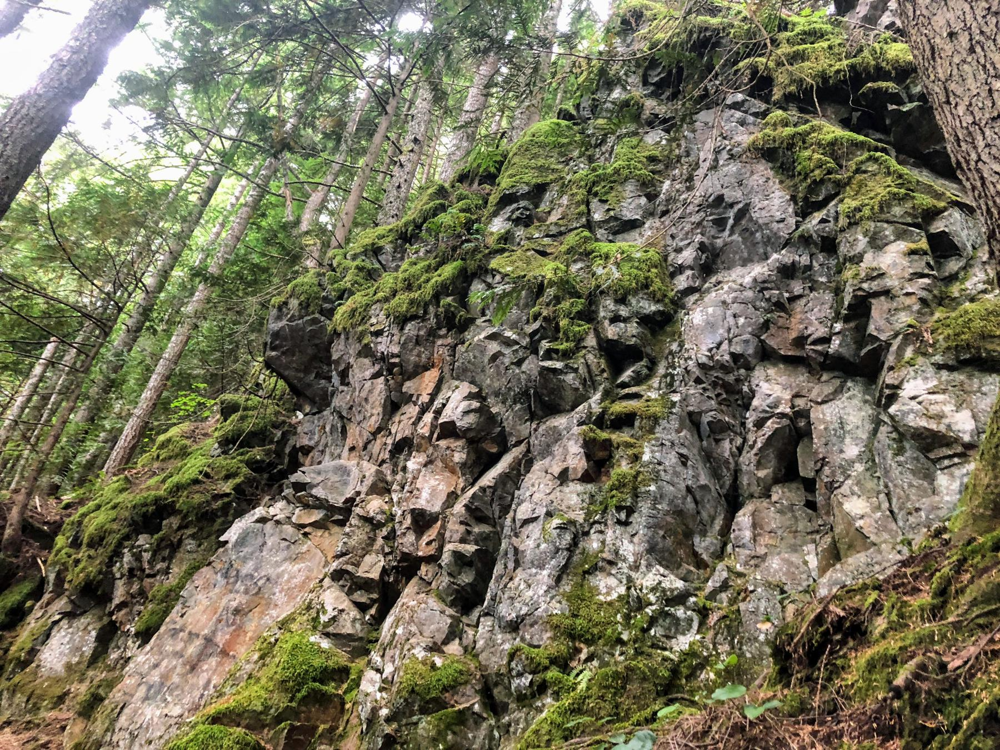
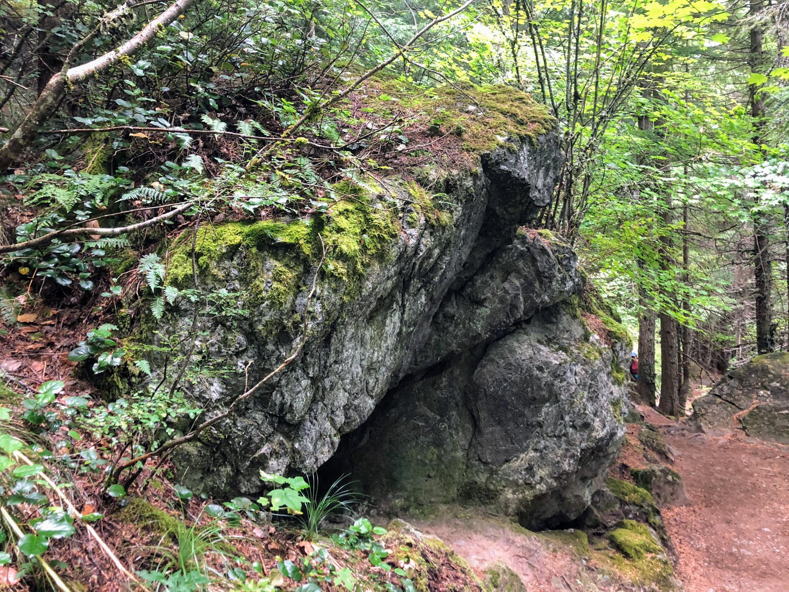
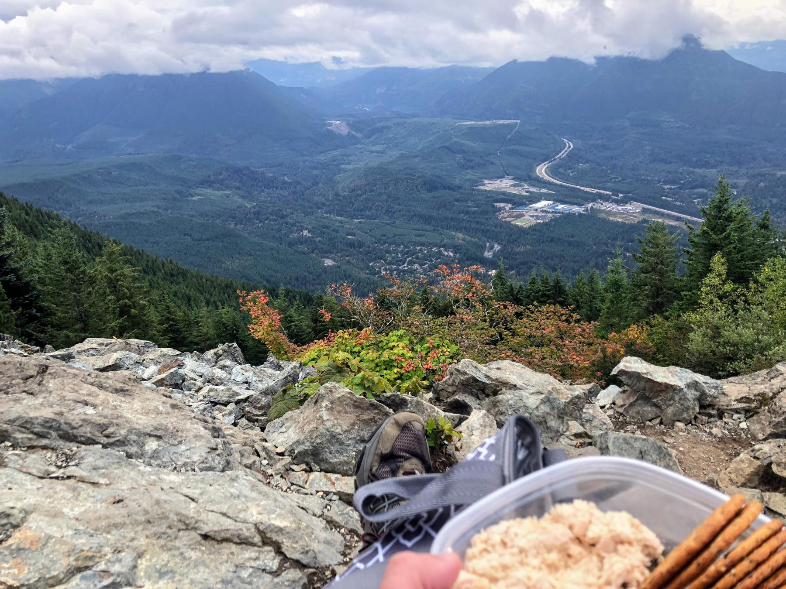
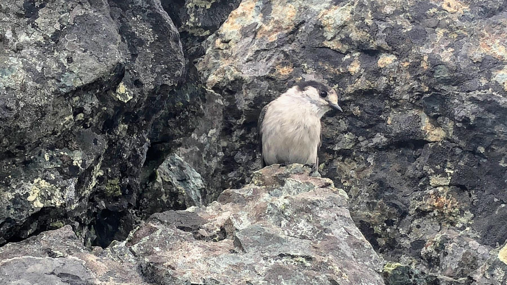
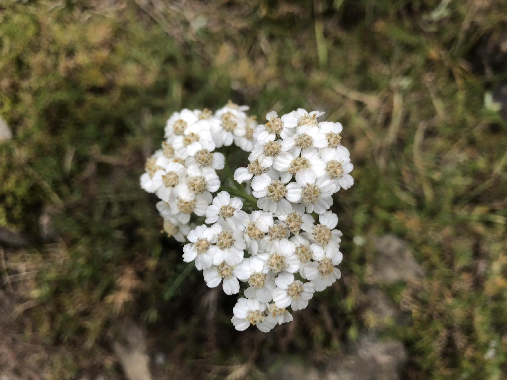
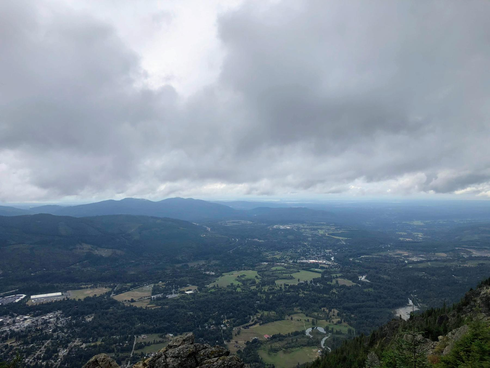
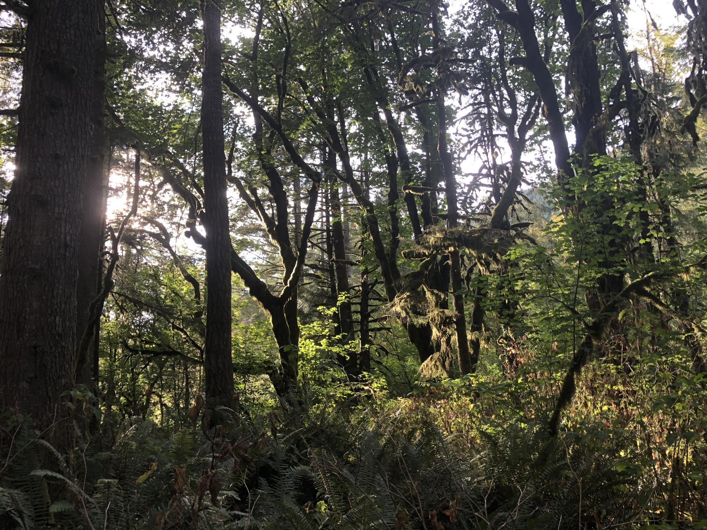

+++
title = "Mount Si"
description = "I sauntered up the main trail of Mount Si this weekend."
date = "2018-09-09 00:00:00-07:00"
draft = false
aliases = [ "/2018/09/09/mount-si/", "/post/2018/09/mount-si/",]

[taxonomies]
category = [ "post",]
tags = [ "exploring", "Marginalia",]
series = [ "sauntering",]

[extra]
card = "social_card.webp"

[extra.cover_image]
caption = "A rather rocky trail through the trees"
path = "cover.jpg"

+++

## Mount Si

If [Mount Si](https://www.wta.org/go-hiking/hikes/mount-si) looks
familiar to you even though you don’t live near it, maybe you saw it as
part of the scenery of the television show [Twin
Peaks](https://en.wikipedia.org/wiki/Twin_Peaks). It sits right next to
the town of North Bend, about 30 miles east of Seattle. Formerly a site
for logging and quarrying, the beauty of the mountain was preserved
through the efforts of state legislator Frances North in the 1970s. It
was officially labeled a Natural Resources Conservation Area in 1987.

The Olympic and Cascade mountains defined my landscape growing up in the
Puget Sound area, but I never went up any of them. I attribute that to
my habit of mentally associating "mountain climbing" with the major
challenge of Mount Rainier. I never thought of smaller mountains such as
Mount Si. They challenge desk-bound people like myself but can still be
done as a single day trip.

Oh, you pronounce "Si" as "sigh" — not "see."

## Getting there

The trail is a short drive from seattle, but Google Maps gave me a hard
time. I ask for directions to Mount Si. It sends me to the base of the
mountain, in somebody’s driveway and nowhere near a trail. Then I ask
for directions to the Mount Si *Trail* and it tries to put me on a
private road. This happens often enough that the owner put up a sign
indicating there was no trail access on their property.

I abandoned Google Maps and found the trail proper a little further up
the (public) road. You want to keep your eyes peeled. The sign for the
trail is easy to miss if you don’t know the area.

Don’t forget about your [Discover Pass](http://discoverpass.wa.gov/)\!
You need one to use the official parking spots, and there’s no public
parking anywhere near the trail.

I admit it. I forgot about the pass. Fortunately, you can purchase one
at the Ace Hardware in North Bend.

## The trail

The thing about [sauntering](/tags/sauntering/) up a mountain is that
the trail occupies most of your attention. You might miss interesting
stuff as you spend a few hours wondering how much trail you have left.
Thankfully, the trail itself is pretty interesting. Some spots soft and
flat, some spots packed with rocks, and sometimes both\!

The trail climbs around 3,000 feet over roughly four miles. A walk like
that is easy enough for the experienced, but by the time I was halfway
up I needed to rest every few minutes. Thank goodness nobody accompanied
me\! I bet a veteran walker would have been at best amused, and at worst
annoyed, by my pace.

Nobody accompanied me, but I wasn’t alone. This trail gets loads of
traffic, and has its own traffic rules.

- If you bring a dog, keep it on a leash, and clean up after it
- People going up get right of way, so people going down need to make
  room for them.
- Be nice
- Stay tidy — don’t be dropping garbage along the way\!

Everybody I encountered stuck with the rules, which were posted on an
information board at the trail head. Well, I met a few off-leash dogs,
but they were friendly.

My frequent breaks meant that I saw most sights while leaning or sitting
on something, and waiting for my pulse to recover.

For example: my new, attractive, and very comfortable friend Stumpy the
Stump.

I encountered impressive rocks all over the place. That’s not unusual in
the Pacific Northwest, but you rarely see anything so *large* in
Seattle.

Of course I looked up the details when I got home. These are
[metamorphic](https://www.usgs.gov/faqs/what-are-metamorphic-rocks-0)
rocks, transformed by intense pressure. Apparently in the distant
geological past, there was an oceanic plate volcano. Now, millions of
years later, we walk around on it and call it Mount Si.

I can’t help but feel very small and brief when I try wrapping my brain
around a geological time scale.

## Lunch

Eventually I ran out of mountain. I paused to have lunch and enjoy the
view with half a dozen other like-minded folks.

I encountered few local critters on the way up. That’s probably because
the ones that tolerate people knew to stick around up here where folks
brought out food. Gray jays, chipmunks, and a wandering raven kept us
company.

Keep a tight grip on your meal\! One jay grabbed a cracker right out of
my hand when a hiker distracted me.

I suppose a bird has to make a living. I can’t be mad when they’re so
fearless and just so *pretty*.

## Wandering a little further

So many folks came up, ate their lunch, and headed right back down. That
confused me, because I was nowhere near done enjoying Mount Si. Maybe
this is just a routine weekend thing for them. Me? Even if this becomes
routine I’ll find excuses to stick around longer. Maybe I can bring my
knitting.

I had read that the trail extended beyond my lunch spot, so I looked
around until I saw the Haystack, an additional 200 feet of rock that
marks the proper peak of Mount Si.

I decided against climbing the Haystack this time. Almost halfway, I
realized going down would be harder than going up. My body still felt
the strain from walking up the mountain in the first place. Next trip.

Got some nice shots before I started back down, though.

I spent the next hour or so lounging in the overlook between the
Haystack and the gray jay crime haven, looking at flowers and
appreciating the view.

Surely the view impresses even more on clear days, but clouds are
familiar to me. A clear sky would have disoriented me.

A memorial marker placed at the overlook caught my eye.

Later I looked up the name on the marker, and found this nwhikers forum
[comment](http://www.nwhikers.net/forums/viewtopic.php?p=202011&sid=1b5ffb6683037d9488f2bbb5e5f4218b#202011):

> Brett Hall was from Lynnwood. His family used to live next door to
> mine. He disappeared on an intended dayhike on Mt Si with, I think, a
> group of friends. They searched at the time but didn’t find him; the
> assumption was that he took a tumble down a hill, or got disoriented,
> sat down and died of hypothermia. I’m not sure about the January 25th,
> 1981 date-- or why they were hiking in the winter. (I was away at
> college at the time, so my info was secondhand.) If I recall, his body
> was found a year or so later after the snow melted.

So, yeah. Caution is smart even on small, popular mountains close to
urban centers.

## Heading back

Once I rested enough — and my phone started running low on charge after
so many pics — I headed back down the trail. Going down took less time
than going up. Even so I took care, because those rocks in the path feel
ever so solid when your feet are landing on them from above.

The sun came out when I was near the bottom of the mountain, and it was
so gorgeous I felt the temptation to climb back up.

My feet would have hated me. Besides, because of my timing, I got back
to Seattle at exactly the right moment to get waved at on West Seattle
Bridge by a trolley bus full of furries having their own special day\!
That was an awesome "welcome home\!" moment.

## The aftermath

I wore better shoes than at [Island Center
Forest](/post/2018/08/island-center-forest/), so my feet feel fine
today. My knees got more work than usual, but at least I can walk
without major discomfort.

One thing is for sure: next time I go walking up a mountain, I bring my
[knitting](/tags/knitting)\!