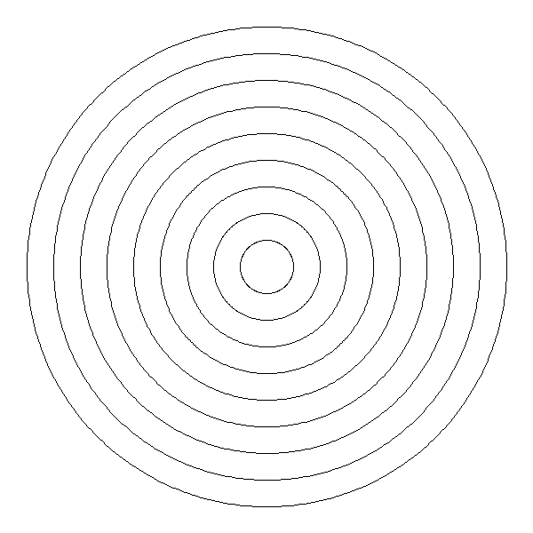
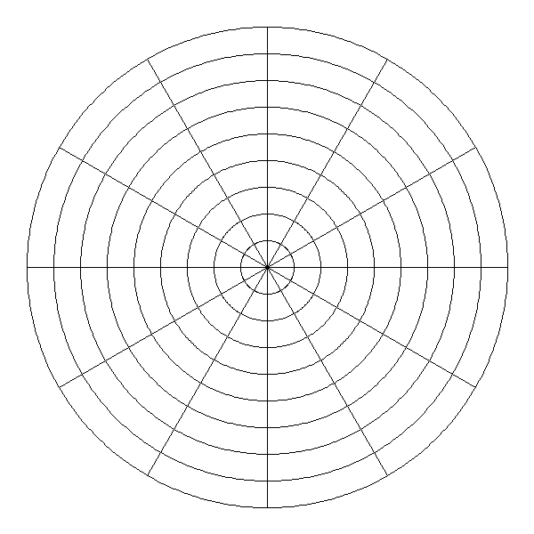
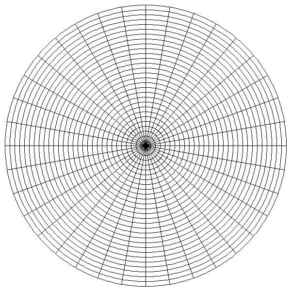
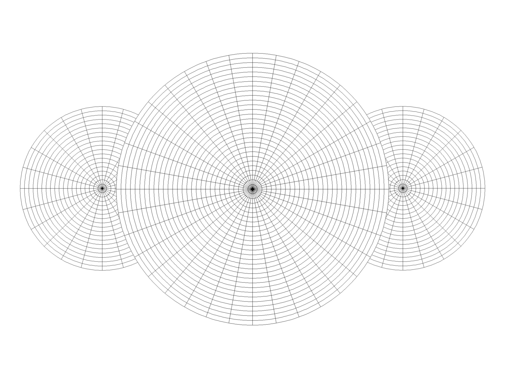

+++
title = "Circular Grids With Python and Pillow"
description = "I want a circular grid for drawing. Let's make one with Python!"
date = "2019-01-23 00:00:00-08:00"
draft = false
aliases = [ "/2019/01/23/circular-grids-with-python-and-pillow/", "/post/2019/01/circular-grids-with-python-and-pillow/",]

[taxonomies]
category = [ "post",]
tags = [ "python", "Programming",]

[extra]
card = "social_card.webp"

[extra.cover_image]
caption = ""
path = "cover.png"

+++

A while back, I wrote about [drawing
grids](/post/2017/11/drawing-grids-with-python-and-pillow/) with
[Python](https://www.python.org/) and
[Pillow](https://python-pillow.org/). I no longer use that code so much,
since [Procreate](/tags/procreate) now includes square grids in its
drawing aid tools.

One idea sitting in my [Taskwarrior](/tags/taskwarrior) queue for a full
year now would still be useful, though. A circle template could help me
break out of the square grid with my [Celtic](/tags/celtic) and
[Tangle](/tags/zentangle) drawings.

I already create circular drawings using symmetry tools in my drawing
apps. Those are doodles, though: unplanned and improvised. I sketch and
see what the automated symmetry produces from my linework. Circle
templates simplify *planning* a complex image which I then produce,
probably without using symmetry tools.

So, let’s write a little code!

I’ll keep using Python, since that worked for me last time. Lately I
have been using the [Anaconda
Distribution](https://www.anaconda.com/download/) for my Python
programming needs. It includes a number of [Python
packages](https://docs.anaconda.com/anaconda/packages/py3.7_linux-64/),
including Pillow\!

My template includes three characteristics:

- an origin in the center of my square image
- some concentric circles increasing in radius by a fixed amount
- some line segments slicing the image from the origin point to the
  outermost circle

## Write some code

I will save myself effort by grabbing some of the work used for drawing
grids and putting into a new class.

``` python
"""
Utility script to draw concentric circle templates for drawing
"""

import argparse

from PIL import Image, ImageDraw

DEFAULT_SIZE = 600
DEFAULT_CIRCLES = 10
DEFAULT_SLICES = 12

class CircleTemplate:
    """
    Draws a circle template
    """
    def __init__(self, size, circle_count, slice_count):
        self.size = size
        self.circle_count = circle_count
        self.slice_count = slice_count
        self.image = Image.new(mode='L', size=(size, size), color=255)

    def save(self):
        """Write my circle template image to file"""
        filename = "circle-{}-{}-{}.png".format(self.size, self.circle_count, self.slice_count)
        print("Saving {}".format(filename))
        self.image.save(filename)

    def show(self):
        """Display my circle template image on screen"""
        self.image.show()

def main():
    """Create a circle template from command line options"""
    # Get details from command line or use defaults
    parser = argparse.ArgumentParser()
    parser.add_argument("--size", help="length of image side in pixels",
                        type=int, default=DEFAULT_SIZE)
    parser.add_argument("--circles", help="number of circles",
                        type=int, default=DEFAULT_CIRCLES)
    parser.add_argument("--slices", help="number of slices",
                        type=int, default=DEFAULT_SLICES)
    args = parser.parse_args()
    size = args.size
    circle_count = args.circles
    slice_count = args.slices
    circle_template = CircleTemplate(size, circle_count, slice_count)
    circle_template.show()

if __name__ == '__main__':
    main()
```

My `CircleTemplate` class knows how to construct, save, and show a blank
image. [argparse](https://docs.python.org/3/library/argparse.html)
processes the command line arguments for image size, number of circles,
and number of slices. I added defaults so I don’t have to type in a
value every time I tested the script for this post.

I can build on this framework. Time to fill in the blanks.

## Draw some circles

``` python
from PIL import Image, ImageDraw

class CircleTemplate:
    """
    Draws a circle template
    """
    def __init__(self, size, circle_count, slice_count):
        # ...
        self.midpoint = int(size / 2)
        self._draw()

    # ...

    def _draw(self):
        """Create circles and slices in-memory"""
        draw = ImageDraw.Draw(self.image)
        largest_circle = self._draw_circles(draw)
        self._draw_slices(draw, largest_circle)
        del draw

    def _draw_circles(self, draw):
        if self.circle_count <= 0:
            return 0

        radius_step = int(self.midpoint / self.circle_count)

        for radius in range(0, self.midpoint, radius_step):
            bounding_box = [
                (self.midpoint - radius, self.midpoint - radius),
                (self.midpoint + radius, self.midpoint + radius)]
            draw.arc(bounding_box, 0, 360)
```

I need to figure out my origin, the center for my circles and slices.
Since the image is a square, it will be the same along both the X and Y
axes. This means I only need to calculate a single midpoint.

Each time we move on to a new radius,
[ImageDraw.arc](https://pillow.readthedocs.io/en/stable/reference/ImageDraw.html#PIL.ImageDraw.PIL.ImageDraw.ImageDraw.arc)
creates a circle by drawing a 360 degree arc within `bounding_box`, a
square that extends `radius` pixels from a midpoint along the `x` and
`y` axes.



## Add some pie slices

Right. I could do some moderately clever math to calculate angles and
draw lines from the midpoint, *or* I could use the existing
[ImageDraw.pieslice](https://pillow.readthedocs.io/en/stable/reference/ImageDraw.html#PIL.ImageDraw.PIL.ImageDraw.ImageDraw.pieslice)
method to accomplish pretty much the same thing. If you read the section
title, you can probably guess what I chose.

``` python
class CircleTemplate:
    # ...
    def _draw(self):
        """Create circles and slices in-memory"""
        draw = ImageDraw.Draw(self.image)
        largest_circle = self._draw_circles(draw)
        self._draw_slices(draw, largest_circle)
        del draw

    def _draw_circles(self, draw):
        if self.circle_count <= 0:
            return 0

        radius_step = int(self.midpoint / self.circle_count)
        # To remember the largest circle we drew.
        last_radius = 0

        for radius in range(0, self.midpoint, radius_step):
            bounding_box = [
                (self.midpoint - radius, self.midpoint - radius),
                (self.midpoint + radius, self.midpoint + radius)]
            draw.arc(bounding_box, 0, 360)
            last_radius = radius

        return last_radius

    def _draw_slices(self, draw, radius):
        if self.slice_count <= 0:
            return

        pie_box = [
            (self.midpoint - radius, self.midpoint - radius),
            (self.midpoint + radius, self.midpoint + radius)]
        angle = 360 / self.slice_count
        start_angle = 0

        for pieslice in range(1, self.slice_count):
            end_angle = angle * pieslice
            draw.pieslice(pie_box, start_angle, end_angle)
```

I’m dividing the 360 degrees of a circle into slice\_count pieces.
`ImageDraw.pieslice` draws a tidy wedge at the angles we give it fitting
the bounding box defined by my largest circle.

How does that look?



It looks pretty cool.

I need more circles and slices for the drawings I’m thinking of, though.
Many more.

``` console
$ python3 circle_template.py --circles=30 --slices=36
Saving circle-600-30-36.png
```

Yes, that’s more like it.



This is all I need for a drawing template. Using transformation tools
and the right blending modes, I can manuever and manipulate my grid
however I need for a drawing template\!



I’ll stop here so I can get to my drawing.