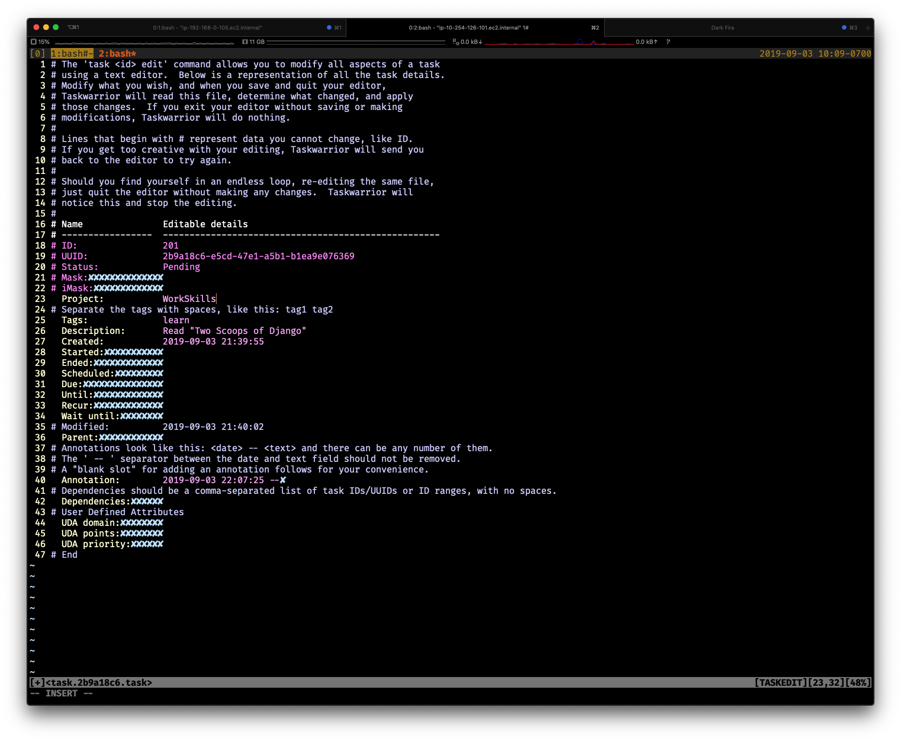

+++
title = "Taskwarrior Editing Refinements"
description = "In which I mention more ways to edit Taskwarrior tasks"
date = "2019-09-05 00:00:00-07:00"
draft = false
aliases = [ "/2019/09/05/taskwarrior-editing-refinements/", "/post/2019/09/taskwarrior-editing-refinements/",]

[taxonomies]
category = [ "post",]
tags = [ "taskwarrior", "Tools",]
series = [ "Taskwarrior Babysteps",]

[extra]
card = "social_card.webp"

[extra.cover_image]
caption = ""
path = "cover.png"

+++

<aside class="admonition tldr">
  
tl;dr

`edit` and `append` give additional ways to update your
[Taskwarrior](https://taskwarrior.org) tasks. `undo` is there for the
errors you catch quickly.

</aside>

I mentioned `modify` early on, and it works. But it’s real easy to make
silly mistakes. Time to talk about a couple extra
[commands](https://taskwarrior.org/docs/commands/) that reduce the
impact of little daily blunders.

## `modify`

So let’s say I got a [book](https://www.twoscoopspress.com/) for
work-related learning. I create a task.

    $ task add 'Read "Two Scoops of Django"'
    Created task 201

Oh wait, this a learning task, so I should add the `+learn` tag. I’ll
use `modify` to add the forgotten tag.

    $ task 201 modify +learn
    $ task 201 ls

    ID  Tags  Description
    201 learn Read "Two Scoops of Django"

<aside class="admonition note">
  
Note

`task ls` shows a condensed report with the most important details of
filtered tasks. Very useful for quick summaries and blog posts.

</aside>

So far so good, right? As long as there’s no confusion about what you’re
changing, `modify` does the right thing. But a typo? A typo can rewrite
your description.

Maybe I’ll add that task to my "WorkSkills" project. What if my fingers
forget that the syntax is `project:WorkSkills`?

It happens. Frequently. Judge me all you want.

    $ task 201 modify project WorkSkills
    $ task 201 ls

    ID  Tags  Description
    201 learn project WorkSkills

Oops.

Fortunately I caught it quick, so I can fix my mistake with `undo`.

## `undo`

`task undo` reverts the last change you made, and can keep going back
through your history one change at a time.

    $ task undo

    The last modification was made 9/3/2019

                 Prior Values                          Current Values
    description  Read "Two Scoops of Django"           project WorkSkills
    entry        2019-09-03                            2019-09-03
    modified     2019-09-03                            2019-09-03
    status       pending                               pending
    tags         learn                                 learn
    uuid         2b9a18c6-e5cd-47e1-a5b1-b1ea9e076369  2b9a18c6-e5cd-47e1-a5b1-b1ea9e076369

    The undo command is not reversible.  Are you sure you want to revert to the previous state? (yes/no) yes
    Modified task reverted.

Taskwarrior tells me what values will be affected by an `undo`, which I
find helpful. Yes, I want to restore previous state.

    $ task 201 ls

    ID  Tags  Description
    201 learn Read "Two Scoops of Django"

Whew. All better.

History is a JSON stream in `~/.task/undo.data` if you’re curious. I
don’t really know how far back it goes. I often miss my mistakes until
after I made other changes that I’d rather not undo.

## `append`

My typos tend to happen when I’m on a roll. As a result, I don’t notice
them until it’s far too late to `undo`. I use `append` for quick changes
to reduce the risk of a typo making the description unrecognizable. It
behaves like `modify` for adding and changing properties. However,
anything interpreted as a description change gets tacked on the end of
the current description by `append`.

Here’s the same project story as before, but with `append` instead of
`modify`.

    $ task 201 append project WorkSkills
    $ task 201 ls

    ID  Tags  Description
    201 learn Read "Two Scoops of Django" project WorkSkills

I still made my mistake, but at least I can find the task by its
original description.

<aside class="admonition note">
  
Note

`prepend` also exists, and is useful much the same way append is. Which
you use is a matter of preference.

</aside>

But what about bigger changes? Or what about when I change the
description and don’t notice until a couple weeks later?

## `edit`

The `edit` command loads the task details into a template, which it
sends off to your `$EDITOR`. Once written, Taskwarrior updates the task
to reflect changes.

Those `✘` characters are just how I show trailing whitespace in Vim with
[listchars](https://vim.fandom.com/wiki/Highlight_unwanted_spaces).
Anyways, I added "WorkSkills" to the "Project" line and fixed the
description. There is even a line where I can add an annotation if I
want, but not today. As soon as I save the file and quit my editor,
Taskwarrior applies my changes.

See?

    $ task 201 ls

    ID  Project    Tags  Description
    201 WorkSkills learn Read "Two Scoops of Django"

I feel better now. I’ve been wanting to mention these commands in the
series for a while now. Since February 2018, according to my task list.