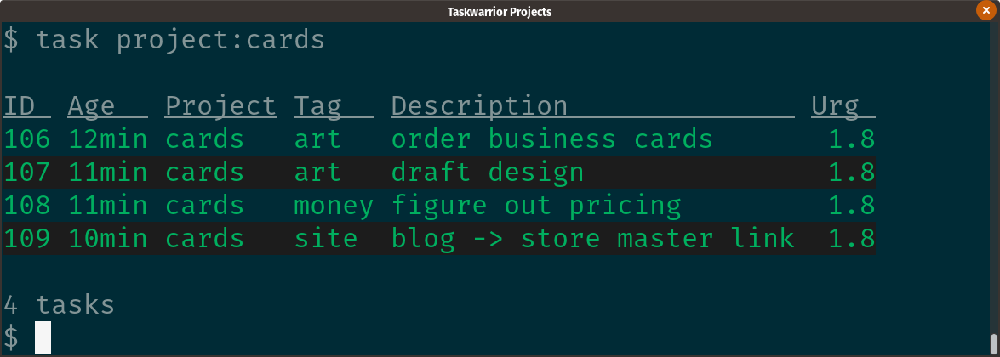
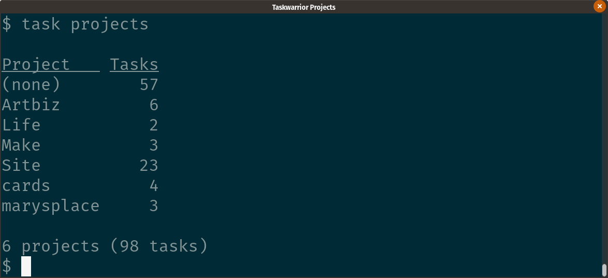
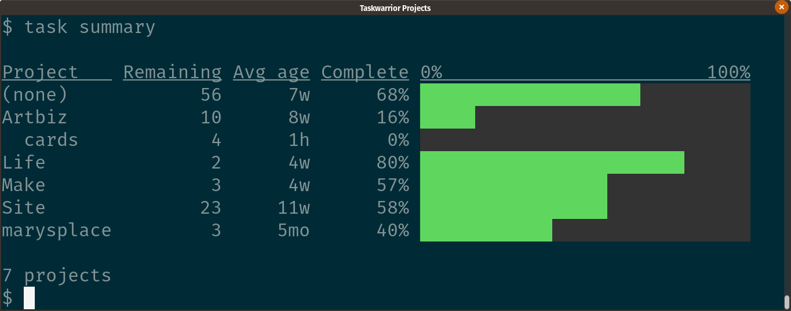

+++
title = "Taskwarrior Projects"
description = "Use Taskwarrior projects to organize closely related tasks!"
date = "2019-02-16 00:00:00-08:00"
draft = false
aliases = [ "/2019/02/16/taskwarrior-projects/", "/post/2019/02/taskwarrior-projects/",]

[taxonomies]
category = [ "post",]
tags = [ "taskwarrior", "tools",]
series = [ "Taskwarrior Babysteps",]

[extra.cover_image]
caption = ""
path = "cover.png"

+++

I went on a work trip to Las Vegas last weekend. I brought a couple
shirts from my [Design By Humans
store](https://www.designbyhumans.com/shop/randomgeek/), thinking my
coworkers might appreciate them. They did\! Turns out random strangers
on the street also loved them\! More than one asked for my business
card. I have none, so those strangers needed to walk away empty handed.

I need to order business cards. I need to put together a simple design
for them, maybe incorporating one of my [drawings](/tags/drawing). I
should find out how much it costs for some cards — depending on how nice
I want them. It might be a good idea to create a master store link here
on the site. That way I can still use the cards if I use a different
store.

This sounds like a project. Fortunately,
[Taskwarrior](https://taskwarrior.org) can help me track it. I mentioned
projects at the [beginning](/post/2017/12/taskwarrior/) of this series.
It’s about time I tried understanding them a little better.

## What is a project in Taskwarrior

A Taskwarrior project is a name that can be shared by many tasks, sort
of like a tag. Unlike tags, each task can only have one project name at
a time. This lets you collect closely related tasks under a single
label.

## Defining a project

Every task has a `project` field, so all you must do to assign a project
is give that field a value.

    $ task add +social project:cards order business cards
    $ task add project:cards +art draft design
    Created task 107.
    The project 'cards' has changed.  Project 'cards' is 0% complete (2 of 2 tasks remaining).
    $ task add project:cards +money figure out pricing
    Created task 108.
    The project 'cards' has changed.  Project 'cards' is 0% complete (3 of 3 tasks remaining).
    $ task add project:cards +site 'blog -> store master link'
    Created task 109.
    The project 'cards' has changed.  Project 'cards' is 0% complete (4 of 4 tasks remaining).

<aside class="admonition note">

Note

Quote your project names if you want to use multiple words.

    $ task add +social project:'business cards' order business cards

</aside>

As you add and complete tasks in a project, Taskwarrior gives you a
quick summary of the project’s status. Taskwarrior includes a quick
blurb about project status as you add and complete tasks in that
project.

Projects work for these new tasks. They all work towards the same goal,
even though there isn’t a clear
[dependency](/post/2018/02/setting-task-dependencies-in-taskwarrior/)
between them. I suppose I could wait until I have the design, pricing,
and link ready, but those other items can be finished in any order. To
be honest, I don’t mess much with depends unless I need the reminder.

Now let’s take a look at those tasks. They’ll get lost with all the
others, so filter by project name.

    $ task project:cards

Since some tasks have a project, Taskwarrior creates a new column in the
`next` report. There’s also a slight bump to Urgency when you define a
project.

It’s often useful to see what active projects you have.

## Listing projects

The `projects` report lists your projects with pending tasks, and the
number of tasks for each project.

    $ task projects

There’s also an entry for tasks that have no project, but fight the
temptation to make a project for every task. That can end up making
things more confusing.

## Subprojects

Notice how I have an "Artbiz" project? That’s supposed to be focusing on
ways to make money with my art. That may or may not be a good thing to
lump under a project, but there it is.

My cards project is obviously part of the broader "Artbiz" project, and
I can show that with subprojects.

    $ task project:cards modify project:Artbiz.cards
    - Project will be changed from 'cards' to 'Artbiz.cards'.
    Modify task 106 'order business cards'? (yes/no/all/quit) all
    Modifying task 106 'order business cards'.
    Modifying task 107 'draft design'.
    Modifying task 108 'figure out pricing'.
    Modifying task 109 'blog -> store master link'.
    Modified 4 tasks.
    The project 'cards' has changed.  Project 'cards' is 0% complete (0 of 0 tasks remaining).
    The project 'Artbiz.cards' has changed.  Project 'Artbiz.cards' is 0% complete (4 of 4 tasks remaining).

The period character separates the name of the main project from its
subproject. Subprojects can have their own subprojects, but be careful
about making your life too complicated. This is still just a single
string of text, and a typo can create an unintended new project.

Then again — because it’s just a single string, it’s easy enough to
change back with `modify`.

What does `projects` look like when you have subprojects? The subproject
is listed beneath its main project, indented slightly to show the
relation.

The `projects` report is useful as a minimal project listing, but what
if you want more information?

## Summarizing tasks by project

That’s when you use the `summary` report.

    $ task summary

The first two columns of `summary` give the same information as
`projects`. You also get the average age of pending tasks in each
project, and the percentage completed for each project, both as a number
and as a progress bar\!

Isn’t that cool?

*I* think it’s cool, anyways.

## Wrapping up

That about wraps it up for Taskwarrior projects. Oh I do have one more
note.

I tried an experiment. Every task would get put into a project or
subproject. I *thought* it would help me categorize my tasks with
something broader than a tag. Something like how I use categories here.
Then I could use project history to track my progress in these broad
categories.

It didn’t work out like that.

Suddenly every task required additional work, limiting Taskwarrior’s
utility for jotting down quick ideas. Even after creating a task, my
urge to organize had me shuffling assigned projects for existing tasks.
And what about completed tasks? Should I assign them to projects?

No. Basically, no. I quit the experiment.

Sometimes a TODO is just a TODO. Tags usually provide all you need to
categorize tasks. Sometimes a project is described well enough by
dependencies.

Do I still use projects? Sure\! Usually well after task creation, when I
see the relations better.

What rules do I use for projects now?

- If some tasks clearly contribute to the same specific goal, I might
  put them in a shared project.
- Even though this site won’t end until I die, its tasks are already
  mentally slotted into an ongoing project. I reflect that with my
  Site project, with *occasional* subprojects for specific goals
  within the context of the Web site.

That is enough advice from me. Do whatever works best for you.

Have fun! Get stuff done!