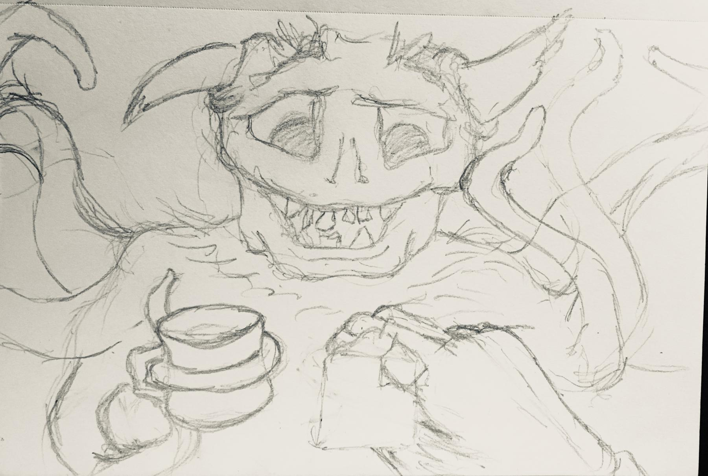

+++
title = "Teabagging a Monsto"
description = "Yeah I know. That's not what \"teabagging\" is."
date = "2019-05-06 00:00:00-07:00"
draft = false
aliases = [ "/2019/05/06/teabagging-a-monsto/", "/post/2019/05/teabagging-a-monsto/",]

[taxonomies]
category = [ "post",]
tags = [ "drawing", "Procreate", "Craft",]

[extra]
card = "_card.webp"

[extra.cover_image]
caption = ""
path = "cover.jpg"

+++

So there was a [tweet exchange](https://twitter.com/wholemilk/status/1124911645786959872) with
a friend on Sunday.



I didn’t think to ask for context. Context is generally unexpected on
Twitter, and sometimes downright unwelcome. Presumably Rachel’s friend
was interacting oddly with monsters in a game. Or maybe not. I don’t
judge.

I still replied, of course. Even without context. We follow each other.
We’re friends outside of Twitter. It *should* be okay.



Random note, since I’d still like this to be a useful post. Here are a
few guidelines for a happy life on Twitter.

- If you don’t hear your name, don’t come running.
- If you thought you heard your name, don’t come running unless you
  know each other.
- Most important: save your dumb jokes for your friends, not the
  random strangers who get retweeted into your timeline. That ticks
  off the strangers.
- Remember you might tick your friends off sometimes too. Just try to
  be considerate.

Anyways. Overnight my mind wandered, and by Sunday afternoon the
wandering had turned into a sketch. I mean I know what
[teabagging](https://www.urbandictionary.com/define.php?term=teabagging)
is. Be careful, that’s an Urban Dictionary link, and most definitely not
safe for work.

But what if "teabagging" meant something else? What if it merely
involved fetching a fresh bag of tea for your friendly monster guest?

Being the sort of person I am, I had to embellish the script in
[Procreate](https://procreate.art). And then post it in the thread.



I’m not going to lie. I like this picture. Picked a small number of main
colors and adjusted saturation and brightness to build on those. The
horns are great. And that is a respectable teabag.

Perfect for teabagging the monstos.