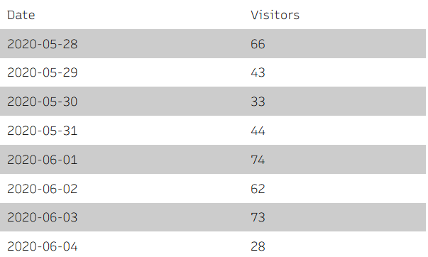
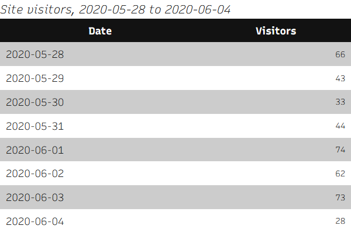
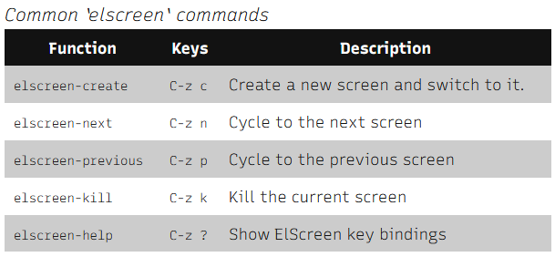

+++
title = "CSV and Data Tables in Hugo"
description = "Am I reinventing reStructuredText with shortcodes? Don't judge me."
date = "2020-06-06 17:40:07-07:00"
draft = false
aliases = [ "/post/2020/06/csv-and-data-tables-in-hugo/",]

[taxonomies]
category = [ "post",]
tags = [ "hugo", "data", "showing it anyways", "csv", "rst", "and a dog", "Tools",]

[extra]
card = "_card.webp"

[extra.cover_image]
caption = "I've been looking at screenshots all day. Here's Loud Dog instead."
path = "cover.jpg"

+++


[hugo]: https://gohugo.io
[transform-unmarshal]: https://gohugo.io/functions/transform.unmarshal/
[split]: https://gohugo.io/functions/split/

Use [Hugo][hugo]’s [`transform.Unmarshal`][transform-unmarshal] to turn strings
into data structures, which you can feed into a table template. But sometimes
[`split`][split] makes more sense.


I figured out how to write Hugo [shortcodes](https://gohugo.io/templates/shortcode-templates/) to generate [tables](https://developer.mozilla.org/en-US/docs/Web/HTML/Element/table) from [CSV](https://en.wikipedia.org/wiki/Comma-separated_values) and other formats. Didn’t even occur to me that it was possible — or this easy — so I had to share.

This approach only works as-is for uniform, shallow structures: every row has
the same number of fields, and every field translates cleanly to a string. If
you have more complex structures, you need more complex templates.

## Why?

Most Markdown parsers include some way to handle tables. Usually it involves
drawing your table with ASCII characters. Something like this, from an older
post of mine about [elscreen](/post/2017/01/elscreen):

``` markdown
Function            | Keys    | Description
--------------------|---------|-------------------------------------
`elscreen-create`   | `C-z c` | Create a new screen and switch to it.
`elscreen-next`     | `C-z n` | Cycle to the next screen
`elscreen-previous` | `C-z p` | Cycle to the previous screen
`elscreen-kill`     | `C-z k` | Kill the current screen
`elscreen-help`     | `C-z ?` | Show ElScreen key bindings
```

I can read it just fine, but I find managing Markdown tables tedious without
editor extensions. I want easy tables. I don’t care if they look like a table
while I’m editing them. If I can copy and paste something into a shortcode?
Even better.

[reStructuredText](https://docutils.sourceforge.io/rst.html) and [Asciidoctor](https://asciidoctor.org) both provide table-handling approaches beyond drawing ASCII, though the default [rst table](https://docutils.sourceforge.io/docs/ref/rst/restructuredtext.html#tables) is lovely if you *do* like fiddling with columns. I looked at them for shortcode inspiration — particularly rst’s [csv-table](https://docutils.sourceforge.io/docs/ref/rst/directives.html#id4) and [list-table](https://docutils.sourceforge.io/docs/ref/rst/directives.html#list-table) directives.

## CSV tables

First up: CSV, "Comma-Separated Values". I work a fair amount with CSV on the command line. I may want to copy and paste something into a table for a blog post every once in a while.

A `csv-table` shortcode could contain any CSV data.
Maybe something from the [Awesome Public Datasets](https://github.com/awesomedata/awesome-public-datasets)?
Nah, I’ll just use my <https://plausible.io> visitor count for the last week.

``` text

Date,Visitors
2020-05-28,66
2020-05-29,43
2020-05-30,33
2020-05-31,44
2020-06-01,74
2020-06-02,62
2020-06-03,73
2020-06-04,28

```

My shortcode receives that data as a string in the [`.Inner`](https://gohugo.io/templates/shortcode-templates/#inner) variable. How to turn that string into a table?

### Just use `transform.Unmarshal`

Give [`transform.Unmarshal`][transform-unmarshal] a formatted string, and it
gives you back a data structure. CSV text becomes an array of arrays, which we
turn into a table by iterating through everything with
[`range`](https://gohugo.io/functions/range/).

**`layouts/shortcodes/csv-table.html`**

``` text

{{ $rows := .Inner | transform.Unmarshal }}

<table>
  {{ range $rows }}
    <tr>
      {{ range . }} <td>{{ . }}</td> {{ end }}
    </tr>
  {{ end }}
</table>

```

Voila! Instant table!



Not bad, but it could be better.

- that first row provides column names, which works better as table headers than just another row
- I prefer a particular style for numeric columns
- what about a summary caption?

Give me a minute.

### Fine-tuning the table with parameters

I’ll add a parameter for the caption. Maybe another parameter indicating
whether to expect a header row, since the first row of CSV doesn’t *always*
contain column names.

``` text

Date,Visitors
...

```

Now that I know how I want to use the shortcode, it’s time to implement the details.

**layouts/shortcodes/csv/table.html**

``` text
{{ $caption := .Get "caption" }}
{{ $useHeaderRow := .Get "header" }}
{{ $rows := .Inner | transform.Unmarshal }}

<table>
  {{ with $caption }}<caption>{{ . }}</caption>{{ end }}
  {{ if $useHeaderRow }}
    {{ $headerRow := index $rows 0 }}
    {{ $rows = after 1 $rows }}
    <tr> {{ range $headerRow }} <th>{{ . }}</th> {{ end }} </tr>
  {{ end }}
  {{ range $rows }}
    <tr>
      {{ range . }}
        {{ if (findRE "^\\d+$" .) }}
          <td class="numeric">{{ . }}</td>
        {{ else }}
          <td>{{ . }}</td>
        {{ end }}
      {{ end }}
    </tr>
  {{ end }}
</table>
```

- if there’s a header row, [`after`](https://gohugo.io/functions/after/) lets me skip past it when building the data rows
- The regular expression I hand to [`findRE`](https://gohugo.io/functions/findre/) is a little naive, but it works for today

Better!



I still need to fiddle with my styles. This table’s a little wide for these
values. Maybe later.

CSV is great, but `transform.Unmarshal` supports other formats. What about those?

## Digression: data tables

I got a little carried away when I learned how much `transform.Unmarshal` can
do. You could get a data structure from CSV, [JSON](https://json.org),
[TOML](https://github.com/toml-lang/toml), or [YAML](https://yaml.org)!

What about — what about a **data** table? Mind you, I’m not talking about Hugo
[data files](https://gohugo.io/templates/data-templates/) or
[`getJSON`](https://gohugo.io/templates/data-templates/#data-driven-content).
That’s a great idea for later.

No, I’m talking about something similar to the `csv-table` case: arrays of JSON
objects you paste in from somewhere else to add a little information to your
blog post.

Heck, you don’t even need parameters. You could put caption and header details
**in** the data! Might be a good idea to use a list of desired columns instead
of a simple flag. That way we can pick and choose columns without editing the
row objects.

Suppose I extracted details for the US and a couple neighbors from
[COVID19API](https://covid19api.com/).

``` text

{
  "caption": "COVID-19 updates for 6 Jun 2020",
  "headers": [
      "Country",
      "NewConfirmed",
      "TotalConfirmed",
      "NewDeaths",
      "TotalDeaths",
      "NewRecovered",
      "TotalRecovered"
  ],
  "rows": [
    {
      "Country": "Canada",
      "CountryCode": "CA",
      "Slug": "canada",
      "NewConfirmed": 1356,
      "TotalConfirmed": 191894,
      "NewDeaths": 122,
      "TotalDeaths": 15554,
      "NewRecovered": 890,
      "TotalRecovered": 53074,
      "Date": "2020-06-06T23:48:14Z"
    },
    {
      "Country": "Mexico",
      "CountryCode": "MX",
      "Slug": "mexico",
      "NewConfirmed": 4346,
      "TotalConfirmed": 110026,
      "NewDeaths": 625,
      "TotalDeaths": 13170,
      "NewRecovered": 3083,
      "TotalRecovered": 77841,
      "Date": "2020-06-06T23:48:14Z"
    },
    {
      "Country": "United States of America",
      "CountryCode": "US",
      "Slug": "united-states",
      "NewConfirmed": 24720,
      "TotalConfirmed": 1897380,
      "NewDeaths": 921,
      "TotalDeaths": 109132,
      "NewRecovered": 6704,
      "TotalRecovered": 491706,
      "Date": "2020-06-06T23:48:14Z"
    }
  ]
}

```

The logic looks similar to `csv-table`, with adjustments for data format
differences.

**layouts/shortcodes/data-table.html**

``` text
{{ $table := .Inner | transform.Unmarshal }}

<table>
  {{ with $table.caption }} <caption>{{ . | markdownify }}</caption> {{ end }}
  <thead>
    <tr>
      {{ range $table.headers }} <th>{{ . | humanize }}</th> {{ end }}
    </tr>
  </thead>
  <tbody>
    {{ range $table.rows }}
      {{ $row := . }}
      <tr>
        {{ range $table.headers }}
          {{ with (index $row .) }}
            {{ if (findRE "^\\d+$" .) }}
              <td class="numeric">{{ . | lang.NumFmt 0 }}</td>
            {{ else }}
              <td>{{ . }}</td>
            {{ end }}
          {{ end }}
        {{ end }}
      </tr>
    {{ end }}
  </tbody>
</table>
```

These header fields use [camel case](https://en.wikipedia.org/wiki/Camel_case)
names like "TotalRecovered". Piping them through
[`humanize`](https://gohugo.io/functions/humanize/) and
[`title`](https://gohugo.io/functions/title/) transforms them into distinct
capitalized words: "Total Recovered." That’s easier for me to read in a
formatted table.

And — sadly, considering that the topic is
[COVID-19](https://www.mayoclinic.org/diseases-conditions/coronavirus/symptoms-causes/syc-20479963)
cases — [`lang.NumFmt`](https://gohugo.io/functions/numfmt/) makes large
numbers more readable.

#[A data table](data-table.png)

Wonderful! Wonderful formatting, anyways. The details are pretty sobering.
People! Wash your hands and wear a mask!

There’s really only one *slight* problem with `data-table`. I don’t need it.
Not today, anyways.

## What I need: list tables

What about that first table I mentioned? You know, the `elscreen` quick
reference? *That* is the kind of table I need a shortcode for. Something like a
reStructuredText
[list-table](https://docutils.sourceforge.io/docs/ref/rst/directives.html#list-table),
or [Asciidoctor
tables](https://asciidoctor.org/docs/asciidoc-syntax-quick-reference/#tables).

I tried different approaches with `transform.Unmarshal` and mashing YAML, TOML,
or JSON lists into something useful. That got frustratingly brittle. Time to
step back and reevaluate. What’s the simplest structure that still does what I
want?

Maybe something line-oriented?

``` text

Function
Keys
Description

`elscreen-create`
`C-z c`
Create a new screen and switch to it.

`elscreen-next`
`C-z n`
Cycle to the next screen

`elscreen-previous`
`C-z p`
Cycle to the previous screen

`elscreen-kill`
`C-z k`
Kill the current screen

`elscreen-help`
`C-z ?`
Show ElScreen key bindings

```

Every line contains one field. Blank lines separate table rows. No special
prefix characters needed, since everything’s already in a shortcode.

I like it. Easy to write, easy to read, and easy to parse with
[`split`](https://gohugo.io/functions/split/). Well — you need to
[`trim`](https://gohugo.io/functions/trim/) a leading newline because of how
`.Inner` gets handed off, but that’s the only wrinkle so far.

**layout/shortcodes/list-table.html**

``` text
{{ $caption := .Get "caption" }}
{{ $useHeaderRow := .Get "header" }}
{{ $rows := split (trim .Inner "\n") "\n\n" }}

<table>
  {{ with $caption }}
    <caption>{{ . }}</caption>
  {{ end }}
  {{ if $useHeaderRow }}
    {{ $headerRow := index $rows 0 }}
    {{ $rows = after 1 $rows }}
    <tr>
      {{ range (split $headerRow "\n") }} <th>{{ . | markdownify }}</th> {{ end }}
    </tr>
  {{ end }}
  {{ range $rows }}
    <tr>
      {{ range (split . "\n") }}
        {{ if (findRE "^\\d+$" .) }}
          <td class="numeric">{{ . }}</td>
        {{ else }}
          <td>{{ . | markdownify }}</td>
        {{ end }}
      {{ end }}
    </tr>
  {{ end }}
</table>
```



Perfect. This will keep me going for a while. Time to stop before I get too
clever.

Try to keep the original goal in mind when working on a thing. I could try
making a universal data table shortcode. I don’t *need* a universal data table
shortcode. Not yet, anyways.

## What Next?

- Make a universal data table shortcode.

Okay not really, but I can see a few specific conveniences I’d like to add
eventually:

- improve the numeric value handling to recognize and properly format decimal values, including money.
- format dates and timestamps
- support building a simple table from `.Site.Data` or `getJSON`
- control column widths
- control column alignment
- refactor into partials where I can, so there’s less duplication between `csv-table`, `list-table`, and `data-table`

I might steal more ideas from reStructuredText. It’s fun!

Speaking of fun, the dog wants to go outside again.

[hugo]: https://gohugo.io
[transform-unmarshal]: https://gohugo.io/functions/transform.unmarshal/
[split]: https://gohugo.io/functions/split/