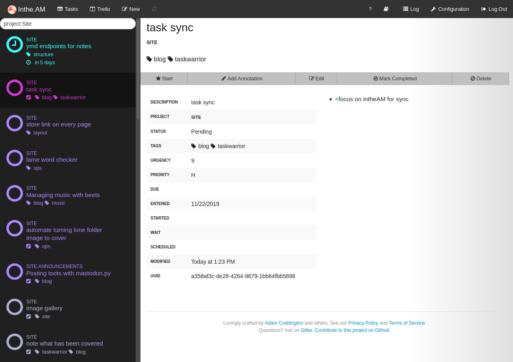

+++
title = "Taskwarrior Sync"
date = "2020-01-26 00:00:00-08:00"
draft = false
aliases = [ "/2020/01/26/taskwarrior-sync/", "/post/2020/01/taskwarrior-sync/",]

[taxonomies]
category = [ "post",]
tags = [ "taskwarrior", "tools",]
series = [ "Taskwarrior Babysteps",]

[extra]
card = "_card.webp"

[extra.cover_image]
caption = "[inthe.AM](https://inthe.am) is pretty, that's for sure."
path = "cover.png"

+++

<aside class="admonition">
    <p class="admonition-title">`tl;dr:`</p>

Set up an account at [Freecinc](https://freecinc.com) or
[inthe.AM](https://inthe.am) to synchronize
[Taskwarrior](https://taskwarrior.org) tasks across all the machines\!

</aside>

## The problem

You’ve been doing great with your tasks. You tag them. You collect them
into projects. You set priorities and due dates. Maybe you even track
blockers and active tasks.

Everything’s great until the day you need to get at your tasks on a
different machine: laptop, work computer, whatever.

How do you get at your carefully maintained task list from another
machine?

<aside class="admonition note">
    <p class="admonition-title">Why not just use your phone?</p>

Well, the mobile Taskwarrior experience is not great. There are a couple
Android apps, but they lack the polish of other mobile task managers. So
far I haven’t seen anything for iOS except a couple seemingly abandoned
projects. You *could* use the mobile web interface for
[inthe.AM](https://inthe.am). Some folks type in `task` commands through
a mobile terminal emulator like [Termux](https://termux.com/).

Me? Mostly I take notes when out and about. Sometimes those notes become
tasks when I’m in front of a computer.

</aside>

## A solution: taskservers

Technically, you could keep your task files on a shared folder like
`Sync/`, `Dropbox/`. I do not recommend it. Eventually your task
management gets ahead of folder synchronization. Now you’re sorting out
file conflicts.

Taskwarrior provides a better solution with
[taskservers](https://taskwarrior.org/docs/taskserver/why.html).
Taskservers manage the details of accessing the task list. They help you
avoid file conflicts, and — even better — give you a backup of your task
history.

### Run your own task server

I’ve done this. It’s fiddly. Not impossible. Just fiddly. Anyone who
wants to host their own taskserver should just play along with [this
slide
deck](https://gitpitch.com/GothenburgBitFactory/taskserver-setup#/). It
provides explicit and careful instructions for setup.

I also suggest you put the taskserver on a host or VPS — something you
can reach from outside your home. I put mine on a Raspberry Pi at home,
but never exposed it to the outside world. Made it difficult to stay
properly synchronized.

### Hosted taskservers

They did the hard work of setting up a taskserver, and made it easy for
you to connect. Hosted taskservers are easy to reach anywhere you have
Internet access.

On the other hand, a copy of your data is on someone else’s server. If
you want total control, you may want to go ahead and run your own.

I’m comfortable with hosted services, so let’s look at a couple I’ve
tried.

#### Freecinc


[Freecinc](https://freecinc.com) seems to have one goal: make it easy to
connect to a taskserver. There are no frills or extra features. It only
serves tasks. But it does that well, with clear and friendly
instructions on setting yourself up. Depending on how long it takes you
to click, copy, and paste, you could be synchronizing tasks in under a
minute. Freecinc is also open source.
[freecinc-web](https://github.com/freecinc/freecinc-web) is available
under the [MIT
License](https://github.com/freecinc/freecinc-web/blob/master/LICENSE).
Clone the repo and deploy your own instance\!

Though yeah — that’s a bit more involved than just connecting to theirs.

#### inthe.AM



[inthe.AM](https://inthe.am) provides features, that’s for sure. You get
task synchronization. Like Freecinc, it provides a hosted taskserver and
makes the [source code](https://github.com/coddingtonbear/inthe.am)
available, using GNU’s [AGPL
license](https://github.com/coddingtonbear/inthe.am/blob/development/LICENSE).
You get a decent — if occasionally sluggish — Web interface. You get
[Trello](https://trello.com/) integration. You get
[taskwarrior-inthe.am](https://github.com/coddingtonbear/taskwarrior-inthe.am),
a helpful command line setup tool.


This is fantastic if you use those features. I have not. For my usage
style, Freecinc and inthe.AM are pretty much the same.

## Using `task sync`

Since I’m not really using inthe.AM’s features, let’s set myself up on
[Freecinc](https://freecinc.com). I click the big friendly "Generate My
Keys" link, and the site tells me what to do.


There are six total steps, consistently almost entirely of downloading
some small files and copying and pasting some commands. Once the `.pem`
files are safe and I set the `taskd` settings, I initialize
synchronization.

    $ task sync init
    Please confirm that you wish to upload all your pending tasks to the Taskserver (yes/no) yes
    Syncing with freecinc.com:53589

    Sync successful.  1516 changes uploaded.

Follow their instructions to set up any other machines you need
connected to the Freecinc taskserver.

Once you go through all that work to set things up, how hard is it to
*use* the
[synchronize](https://taskwarrior.org/docs/commands/synchronize.html)
command?

    $ task log +taskwarrior set up freecinc
    Logged task f053e7ab-1332-4131-8ceb-c2e121e8b00e.
    $ task sync
    Syncing with freecinc.com:53589

    Sync successful.  1 changes uploaded.

That’s it. Run `task sync` occasionally and you’re golden.

## Nits and tips

Task servers dramatically improve life with Taskwarrior. Some little
annoyances become more apparent though. Let’s deal with those now.

### Cutting down on the verbosity

You get tired of this pretty quick:

    226 tasks, truncated to 61 lines
    There are local changes.  Sync required.

The second you need to make a change, you get that message about local
changes. Configure verbosity in your `.taskrc` if you don’t care about
that particular update.

``` ini
verbose=blank,header,footnote,label,new-id,affected,edit,special,project,filter,unwait
```

This removes messages about sync while leaving everything else. If you
want more quiet, try `verbose=off` or even `verbose=nothing`.

<aside class="admonition note">
    <p class="admonition-title">Note</p>

See `man taskrc` for more details about Taskwarrior configuration.

</aside>

### Sync automatically with a cron job

The hardest part of synchronization is remembering to do it. Let’s set
up a [cron](https://opensource.com/article/17/11/how-use-cron-linux) job
so I don’t have to remember.

    $ crontab -e

Hourly should suffice. The
<https://crontab.guru/#0_*>*\**\*\_\*\[crontab guru\] says "hourly"
would look like this:

    0 * * * * /usr/bin/task sync

And that works. But I haven’t gotten around to setting up mail on that
machine, so `cron` discards the output. I have no idea what the sync
result was.

    0 * * * * { printf "\%s: " "$(date "+\%F \%T")"; /usr/bin/task sync } >> /home/randomgeek/logs/task-sync.log 2>&1

This appends a timestamp and the result of `task sync` — including
standard and error ouputs — to a log file.

    2020-01-26 16:00:00: Sync successful.  1 changes uploaded.

*There* we go. I better turn this into a script before I get any more
elaborate with it though. Except I have to go take care of something
else.

No problem, I’ll make a task.

    $ task add +ops +taskwarrior priority:M refactor sync cronjob to script