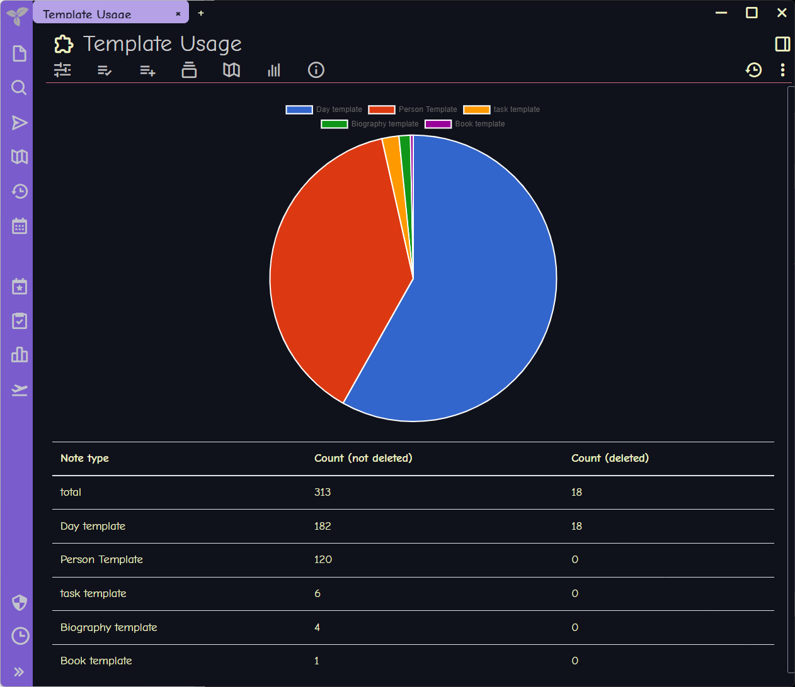

+++
title = "Customizing a Trilium Report"
date = "2022-08-09"
draft = false
description = "In which I frolic with a note system that lets me use SQL"

[taxonomies]
category = [ "post",]
tags = [ "second brain", "trilium notes", "sqlite",]

[extra]
card = "social_card.webp"

[extra.cover_image]
path = "trilium-template-usage.png"
caption = "Trilium also embeds its scripting as notes, which takes some getting used to."

+++

Been exploring [Trilium][trilium] for notes. One thing I'll say is the nerdy features are directly accessible
to my existing skills.

[trilium]: https://github.com/zadam/trilium

<!--more-->

See, each note system has some way — or a plugin providing some way — to query
information about your collected notes. Logseq [uses][lq-queries] Datascript, which is uh Lisp-ish?
Obsidian — if you add the [Dataview][dataview] plugin — has DQL, which is SQL-ish.

[lq-queries]: https://docs.logseq.com/#/page/advanced%20queries
[dataview]: https://blacksmithgu.github.io/obsidian-dataview/

Trilium keeps everything in a [SQLite][sqlite] database that you can
query directly.


My immediate reaction on realizing what I was seeing? Look I don't usually
communicate on this site via memes and image captions, but:


[sqlite]: https://sqlite.org

I know the gist of SQL. Let's play with this.

Made a custom [template][trilium-template] for notes about people. Assigned
that template to the appropriate notes. Got curious about how my template-using
notes were spread out.

[trilium-template]: https://github.com/zadam/trilium/wiki/Template

Copied the query from *Trilium Demo / Statistics / Note type count* and tweaked
it a little for my needs.

```sql
SELECT
    templateNote.title,
    SUM(
        CASE WHEN note.isDeleted=0 THEN 1 ELSE 0 END
    ) AS countNotDeleted,
    SUM(
        CASE WHEN note.isDeleted=1 THEN 1 ELSE 0 END
    ) AS countDeleted
FROM attributes attr
INNER JOIN notes note
    ON note.noteId = attr.noteId
INNER JOIN notes templateNote
    ON attr.value = templateNote.noteId
WHERE
    attr.name = 'template'
GROUP BY attr.value
ORDER BY countNotDeleted desc
```

| title | countNotDeleted | countDeleted |
| --- | --- | --- |
| Day template | 182 | 18 |
| Person Template | 120 | 0 |
| task template | 6 | 0 |
| Biography template | 4 | 0 |
| Book template | 1 | 0 |

{}

I renamed the Trilium demo's included *People template* to *Biography template*
for clarity here.

{}

I duplicated *Note type count*, pasted my new query, then adjusted the layout
JS to reflect the tweaked query.

The result:



The demo graph uses [Chart.js][chartjs], which is fine. I'm already thinking
about using [Vega][vega] instead.

One thing at a time.

Trilium. It's got SQL. I like that.

[chartjs]: https://www.chartjs.org
[vega]: https://vega.github.io