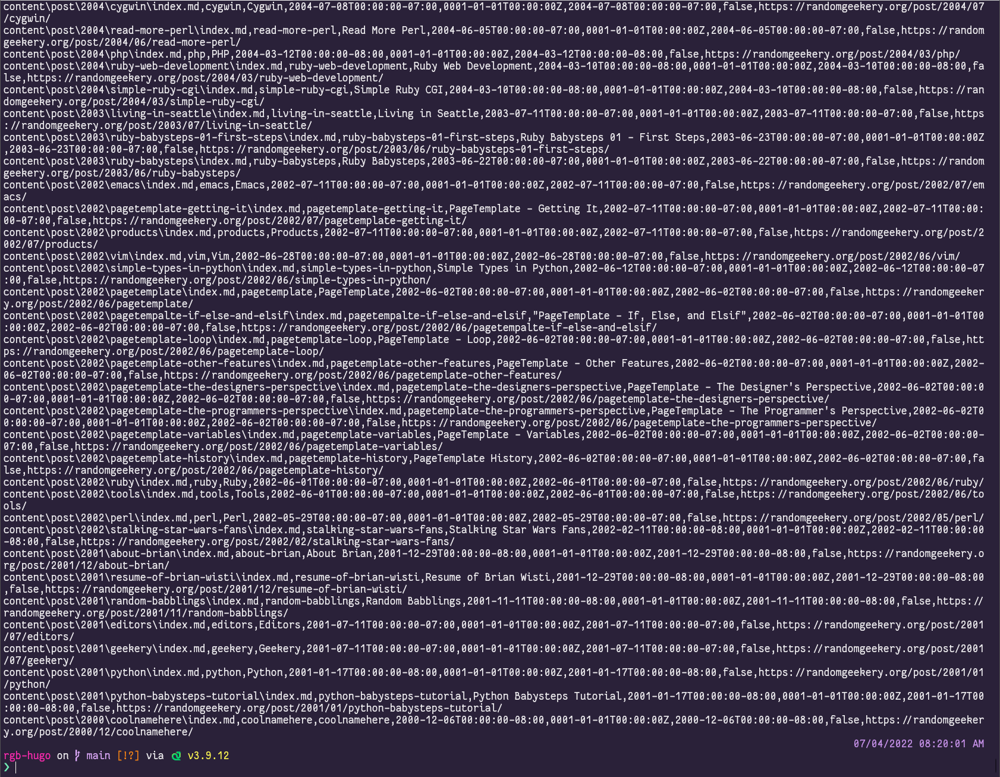
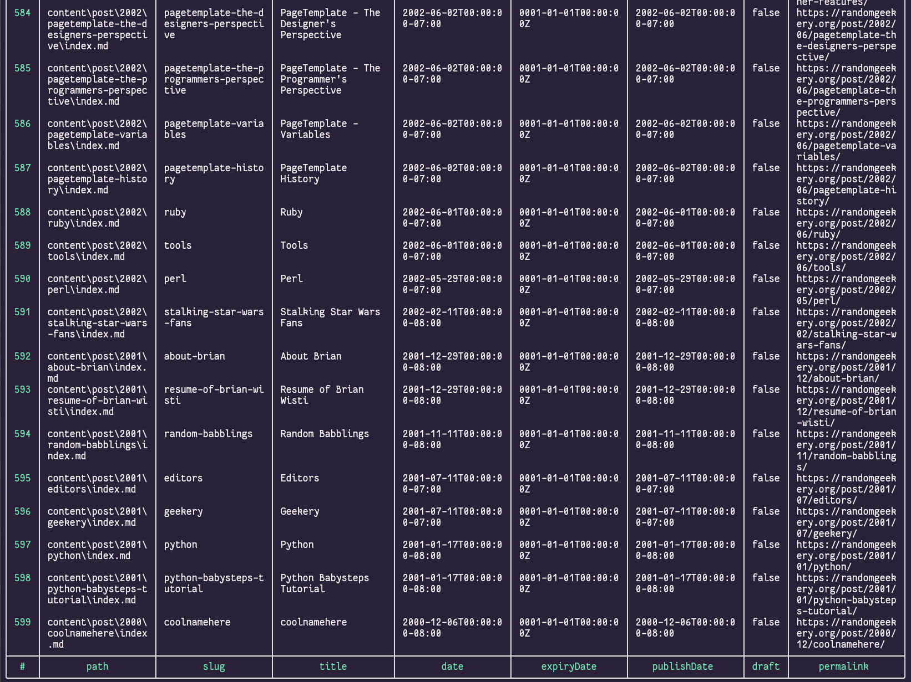
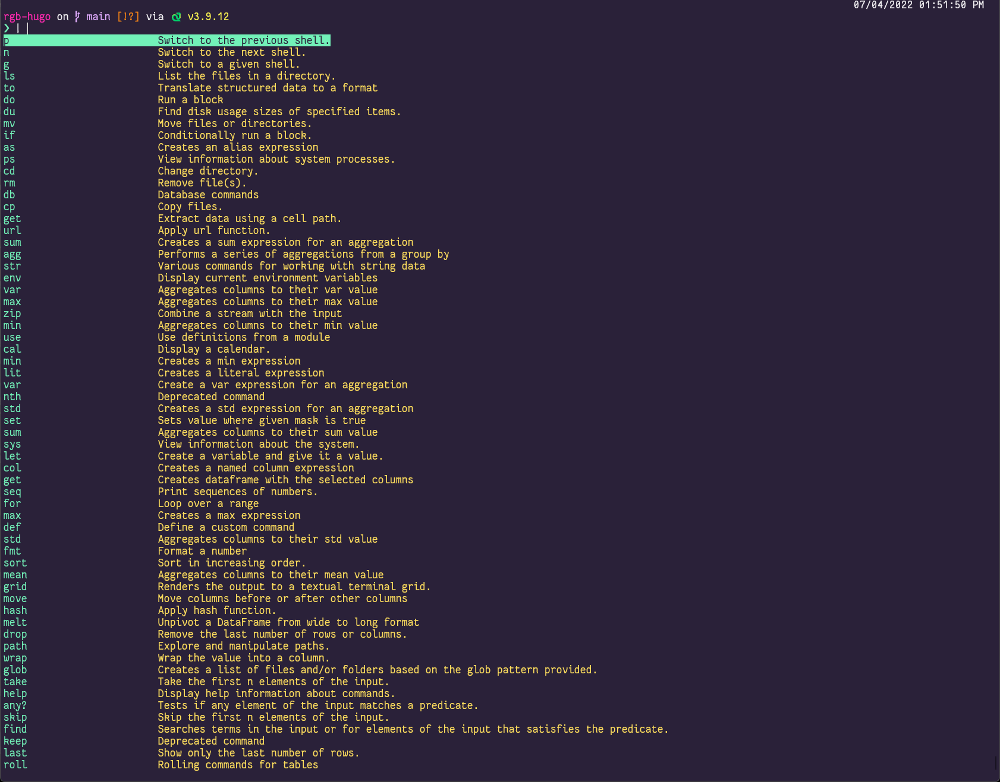
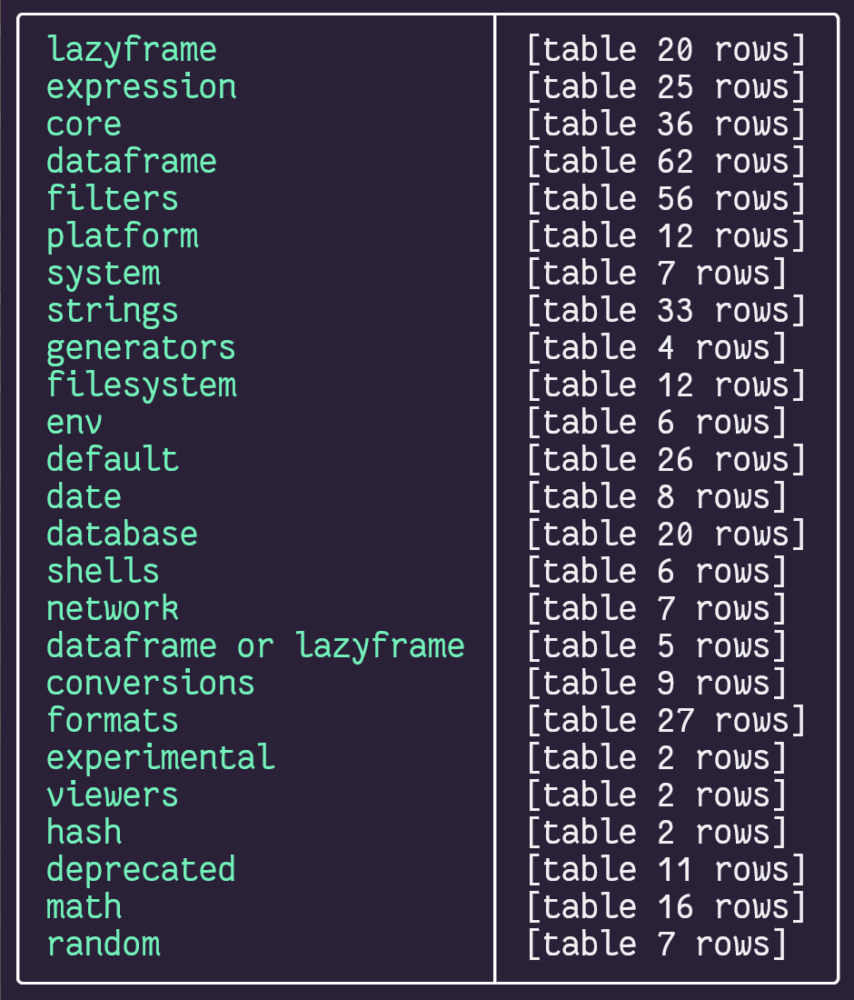
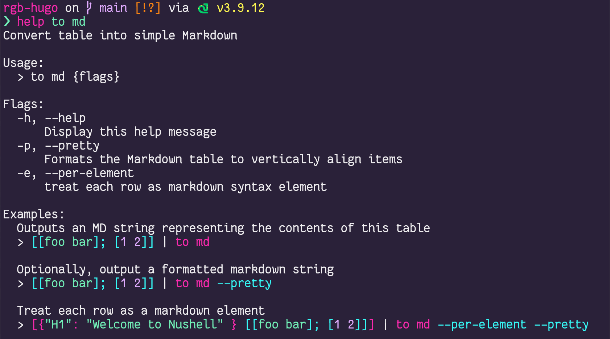

+++
title = "My Three(ish) Favorite Nushell Features"
date = "2022-07-04"
draft = false
description = "In which I once again spend all day decomposing one-liners, this time for Nushell"

[taxonomies]
category = [ "post",]
tags = [ "nushell", "hugo",]

[extra]
card = "social_card.webp"

[extra.cover_image]
path = "post-year-histogram.png"
caption = "histogram for post frequency by year using Nushell built-ins"

+++

Been using the [Nushell][nushell] cross-platform user shell more and more over the last couple years. Might as well start learning it.

[nushell]: https://www.nushell.sh

<!--more-->

Today I use Nushell for one of my favorite learning tasks: examining my site. I made a throwaway one-liner when setting up [Nushell on Windows][nushell-windows-post]. I want to try again, and think through the process a little more this time.

[nushell-windows-post]: /post/2022/trying-nushell-on-windows/

This post, and any that may follow on the topic, won't be any kind of deep dive or contrast with other shells. Oh sure. I'll point out things that surprise me. But I use maybe 20% of a shell's features for 80% of my needs, and a Web search for the rest. Check the Nushell book's [Coming from Bash][nushell-from-bash] page if you want a more explicit comparison.

[nushell-from-bash]: https://www.nushell.sh/book/coming_from_bash.html

Let's get started.

## Nushell feature zero: showing program output

If you can't easily run a program and see its output, you are in a REPL, not a shell. I have not come across a command shell that fails that test yet, but I use it as an immediate reassurance that I haven't confused myself by launching `ipython` again.

I'm on [Hugo][hugo] again, which means I have the Hugo CLI. `hugo list all` prints out a CSV summary of your site, ready for processing by some other program.

[hugo]: https://gohugo.io

``` nushell
hugo list all
```



## Nushell feature zero point five: Piping output

Most shells let you pipe between processes, using the output of one as the input of the next. Nushell provides that functionality. No problem.

```nushell
hugo list all | from csv
```

Of course, the result of that pipe is something a little different from other shells.

## Nushell feature one: tables



There's the table output that I find so appealing. Course, a pretty table is not so unusual these days. You can pipe from `hugo` to any number of CSV processing tools and pretty printers available to install on your machine.

But Nushell tables aren't just pretty printing. They are core to working with the shell. The table you see is a visual representation of a table in memory, which can be further processed however you need.

Also? Nushell doesn't need me to install an extra CSV processing tool. It can turn that output into something useful without any extra help thanks to an abundance of built-in commands.

## Nushell feature two: the built-in commands and interactive help

Nushell includes *many* commands. You can see for yourself skimming through the [Command Reference][cmd-ref]. Or see what's available to you in your current version with `help commands`.

[cmd-ref]: https://www.nushell.sh/book/command_reference.html



How many? Let's ask the shell by piping `help commands` to the `length` command.

```nushell
help commands | length
```

```
421
```

That's a little overwhelming. Let's see if we can narrow it down. That gives me a chance to show off some of the table processing I got so excited about.

### Listing command categories by grouping

All these commands are organized into categories. To see what categories, we can `group` the help table.

```nushell
help commands | group-by category
```




### Listing only commands in a specific category with `where`

I read ahead, so I know that `from csv` is under the "formats" category. We use `where` to narrow the command list down so it only contains the format commands.

```nushell
help commands | where category =~ formats
```




I bet the Perl devs perked up seeing that `=~`. Yes it's a regular expression! But it's almost definitely not a Perl regular expression. I haven't gone past literal substring matches yet, and the Nushell [regex documentation][nu-regex] page is basically a placeholder. I can only suggest you follow their suggestion to read the Rust [regex crate][regex-crate] documentation and figure out the differences yourself.

[nu-regex]: https://www.nushell.sh/book/regular_expressions.html#regular-expressions
[regex-crate]: https://docs.rs/regex/latest/regex/



### Viewing only select columns with `select`

That's still a little busy. How about we `select` the name and usage? And heck — tables make for great screenshots, but let's try see what `to md` gives us.

```nushell
help commands | where category =~ formats | select name usage | to md
```

|name|usage|
|-|-|
|from|Parse a string or binary data into structured data|
|from csv|Parse text as .csv and create table.|
|from eml|Parse text as .eml and create table.|
|from ics|Parse text as .ics and create table.|
|from ini|Parse text as .ini and create table|
|from json|Convert from json to structured data|
|from ods|Parse OpenDocument Spreadsheet(.ods) data and create table.|
|from ssv|Parse text as space-separated values and create a table. The default minimum number of spaces counted as a separator is 2.|
|from toml|Parse text as .toml and create table.|
|from tsv|Parse text as .tsv and create table.|
|from url|Parse url-encoded string as a table.|
|from vcf|Parse text as .vcf and create table.|
|from xlsx|Parse binary Excel(.xlsx) data and create table.|
|from xml|Parse text as .xml and create table.|
|from yaml|Parse text as .yaml/.yml and create table.|
|from yml|Parse text as .yaml/.yml and create table.|
|to|Translate structured data to a format|
|to csv|Convert table into .csv text |
|to html|Convert table into simple HTML|
|to json|Converts table data into JSON text.|
|to md|Convert table into simple Markdown|
|to text|Converts data into simple text.|
|to toml|Convert table into .toml text|
|to tsv|Convert table into .tsv text|
|to url|Convert table into url-encoded text|
|to xml|Convert table into .xml text|
|to yaml|Convert table into .yaml/.yml text|

Awesome. All that and we're still in the realm of Nushell builtin commands.

Note the pattern of commands and subcommands. The "formats" category includes two primary commands, `from` and `to`. Then many subcommands for converting _from_ assorted formats to a table, and their counterparts for converting from a table _to_ assorted formats.

### Getting help for a specific command

We can ask for help with a specific command. Most shells offer this in one form or another, though they don't generally provide the command discovery path we just walked down.

```nushell
help to md
```

One more screenshot, because Nushell help is just so *pretty*.



### Applying what we've got to the Hugo list

Let's see if we can apply some of what we just used with our Hugo article list.

Remember Hugo? This was supposed to be a post about Hugo.

```nushell
hugo list all | from csv | last 5 | select title publishDate | to md
```

|title|publishDate|
|-|-|
|Editors|2001-07-11T00:00:00-07:00|
|Geekery|2001-07-11T00:00:00-07:00|
|Python|2001-01-17T00:00:00-08:00|
|Python Babysteps Tutorial|2001-01-17T00:00:00-08:00|
|coolnamehere|2000-12-06T00:00:00-08:00|

That's better. Sort of. I expected the last few posts to be a bit more recent. I need to do some intentional filtering and sorting. In order to do that, I need a real date instead of Hugo's timestamp string. You can use a block for that.

## Nushell feature two: blocks

The really basic idea is that [blocks][nu-block] run arbitrary commands on a parameter, and let us do what we like with the result.

[nu-block]: https://www.nushell.sh/book/types_of_data.html#blocks

I'm going to do sort of a [dataframe][dataframe] type of action here. That's not a normal state for my brain so I need to step through this slowly.

[dataframe]: https://databricks.com/glossary/what-are-dataframes


`hugo list all` gave me some CSV text.

```
hugo list all
```

`from csv` turned that text into a table.

```
hugo list all | from csv
```

The `publishDate` column describes a date and time, but it contains text strings — not dates. To simplify filtering posts by date range, I want to add a column for the published date described by `publishDate`.

```nushell
hugo list all | from csv | insert published-at ...
```

That `published-at` column contains the result of running a block of commands. I hand my current table to the block as a parameter.

```nushell
hugo list all | from csv | insert published-at { |it| ... }
```

Nushell blocks look and work a bit like  blocks. That means they also work similar to lambdas in  and anonymous functions in other langauges — cosmetic and shell-specific details aside.

The block returns a column with dates for every value in my table's `publishDate` column.

```nushell
(
  hugo list all |
  from csv |
  insert published-at { |it| $it.publishDate | into datetime }
)
```

Nushell uses the shell-like pattern of prefixing variable names with `$` when we reference them.


That's how Nushell does multi-line one-liners.

See, my one-liner's getting a little long. Over in other shells, I'd be pulling out a backslash '\\' to indicate line continuation. But Nushell is expression-oriented. Ending a line with a backslash is just an error. So we turn the whole thing into a subexpression by wrapping it in parentheses. Nushell treats the evaluated result as a single expression, however many lines it takes to get there.

Yes, fine. I _should_ be thinking about scripts at this point. I may get to those eventually. Until then I use parentheses to create a multiline subexpression.


Where were we? Oh right. I have a table with more columns than I care about.

I only want the post titles and the dates they were published.

```nushell
(
  hugo list all |
  from csv |
  insert published-at { |it| $it.publishDate | into datetime } |
  select title published-at
)
```

And I'm writing a blog post, so let's keep a readable number of rows in markdown format.

```nushell
(
  hugo list all |
  from csv |
  insert published-at { |it| $it.publishDate | into datetime } |
  select title published-at |
  last 5 |
  to md
)
```

Okay I think that covers it.

|title|published-at|
|-|-|
|Editors|Wed, 11 Jul 2001 00:00:00 -0700 (20 years ago)|
|Geekery|Wed, 11 Jul 2001 00:00:00 -0700 (20 years ago)|
|Python|Wed, 17 Jan 2001 00:00:00 -0800 (21 years ago)|
|Python Babysteps Tutorial|Wed, 17 Jan 2001 00:00:00 -0800 (21 years ago)|
|coolnamehere|Wed, 06 Dec 2000 00:00:00 -0800 (21 years ago)|

Yeesh I have been writing this stuff down for a long time.

## Nushell feature three: data types

My experience with data types in shells is limited and mostly unpleasant: values are strings that can be interchangeably treated as strings or numbers. Sometimes you can treat them like lists. Oops you broke something.

Nushell [data type][nu-types] support goes past that. For starters, values declared in the shell itself have the appropriate type.

```nushell
1.2 | describe
```

```result
float
```

```nushell
"1.2" | describe
```

```result
string
```

It also supports more complex structured types like records and of course tables. Nushell may not define as many types as [Red][red-types] — yet? — but it has far more than I'm accustomed to seeing from a shell.

[nu-types]: https://www.nushell.sh/book/types_of_data.html
[red-types]: https://github.com/red/docs/blob/master/en/datatypes.adoc

What about conversions? In my fiddling so far, Nushell treats output from external programs like a string until you tell it otherwise, like a moment ago piping Hugo's output `from csv` and then the `publishDate` column `into datetime`.

### Date math

All right. Let's figure this out. What datetime is it right now?

```nushell
date now
```

```result
Mon, 04 Jul 2022 18:08:26 -0700 (now)
```

Happy Fourth of July to those who celebrate by the way. Unless you celebrate by letting off fireworks in your or especially my neighborhood after midnight.

I arbitrarily picked three months as my threshold. Nushell provides numerous shorthands for durations, but so far nothing at an appropriate scale for ancient blogs. I haven't found a lazy way to say "three months ago," but I can say "90 days ago." Close enough for today.

Need to make a subexpression out of `date now` so Nushell has a date it can use for the math.

```nushell
(date now) - 90day
```

```result
Tue, 05 Apr 2022 18:09:31 -0700 (3 months ago)
```

Since `((date now) - 90day)` is a date and `published-at` is a date, I can do a direct comparison.

``` nushell
(
  hugo list all |
  from csv |
  insert published-at { |it| $it.publishDate | into datetime } |
  where published-at > ((date now) - 90day) |
  select title published-at |
  to md
)
```

|title|published-at|
|-|-|
|My Three(ish) Favorite Nushell Features|Mon, 04 Jul 2022 18:00:00 -0700 (10 minutes ago)|
|I Talked About My Site on Test & Code in Python|Fri, 01 Jul 2022 15:04:02 -0700 (3 days ago)|
|Now|Wed, 11 May 2022 08:33:00 -0700 (2 months ago)|
|How About a Tumblelog|Tue, 03 May 2022 19:58:29 -0700 (2 months ago)|
|Added a Neighborhood Blogroll Thing|Wed, 27 Apr 2022 19:47:55 -0700 (2 months ago)|
|Config Tweaks for Nushell|Sun, 24 Apr 2022 15:00:33 -0700 (2 months ago)|
|Trying Nushell on Windows|Fri, 22 Apr 2022 21:15:00 -0700 (2 months ago)|
|Didn't I do this last year too?|Sun, 17 Apr 2022 22:15:00 -0700 (2 months ago)|

Yeah I fibbed on the publish date for the post I'm writing. Figured it would be quicker than adding and explaining another filter for draft posts.

## Wrapping up

True confession time: my three or so favorite features in Nushell are also the only features I've played with, and much of that was today.
Just realized it's been about a year since I started poking at Nushell as more than "that thing with cool `ls` output."

It's not my login `$SHELL` or anything yet — still need to figure out things like `pyenv` and `nvm` — but yeah I like using Nushell.
Especially under Windows, where I know little enough about PowerShell that I can set up Nushell on Windows Terminal and pretend it's a login shell.

Now I just need something that would make a cool cover image screenshot.

```nushell
(
    hugo list all |
    from csv |
    insert year { |it| $it.publishDate | into datetime | date to-record | get year } |
    where year > 1 |
    histogram year --percentage-type relative |
    sort-by year
)
```