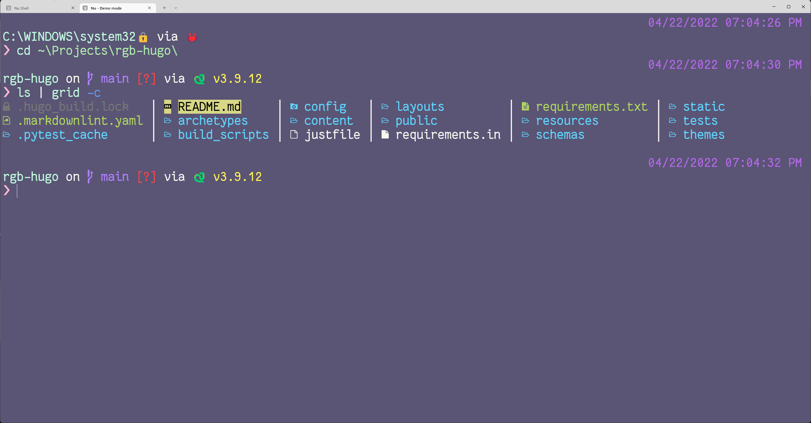

+++
title = "Trying Nushell on Windows"
description = "They say I can run Nushell on Windows. Let's try that."
date = "2022-04-22"
draft = false

[taxonomies]
category = [ "post",]
tags = [ "nushell", "windows", "shell",]

[extra]
card = "social_card.webp"

[extra.cover_image]
caption = "Hugo's article list piped through multiple Nushell built-ins"
path = "nu-hugo-list-all.png"

+++



Jack — one of the cats — has recovered from whatever was bothering him with a little help from vet drugs. Thank goodness for that! Now I can get back to puttering.



I have been puttering a little here and there with [Nushell][nu-home], a command line shell in the spirit of Bash, Zsh, and Fish. It's different from any of the above, though. It starts from the same "let me run my commands" starting point,
but data handling, filtering, and transformation are core to Nu's functionality.

[nu-home]: https://www.nushell.sh

## You said something about Windows

Right. I have also been spending more time in Windows recently. No big deal. I bounce between emphasizing Windows and Linux on my hard drive routinely.

### Installing Nushell with Winget

The quickstart on the Nushell suggests using [winget][winget]. Lucky me, I happen to have played with that recently enough to remember it's there.

[winget]: https://www.nushell.sh/book/installation.html

```
$ winget install nushell
Found nu [Nushell.Nushell] Version 0.61.0
This application is licensed to you by its owner.
Microsoft is not responsible for, nor does it grant any licenses to, third-party packages.
Downloading https://github.com/nushell/nushell/releases/download/0.61.0/nu_0_61_0_windows.msi
  ██████████████████████████████  10.8 MB / 10.8 MB
Successfully verified installer hash
Starting package install...
Successfully installed
```

That installed Nushell to my Program Files. `nu.exe` itself is under `C:/Program Files/nu/bin`. I run that and agree to everything — I don't know Nushell all that well yet, and I certainly don't know Nushell under Windows enough yet.

```
$ C:\"Program Files"\nu\bin\nu
No environment config file found at C:\Users\brian\AppData\Roaming\nushell\env.nu
Would you like to create one with defaults (Y/n):
y
Config file created at: C:\Users\brian\AppData\Roaming\nushell\env.nu
No config file found at C:\Users\brian\AppData\Roaming\nushell\config.nu
Would you like to create one with defaults (Y/n):
y
Config file created at: C:\Users\brian\AppData\Roaming\nushell\config.nu
C:\Users\brian\AppData\Local〉 ls | sort-by modified | last 5
```

And it works!


### Integrating with Windows Terminal

[Windows Terminal][windows-terminal] is my preferred terminal emulator over in the Windows world. Though I could absolutely point and click my way through adding a Nushell profile, I'll follow [Setting the default shell][nu-default-shell] and update `settings.json` myself.

[windows-terminal]: https://docs.microsoft.com/en-us/windows/terminal/
[nu-default-shell]: https://www.nushell.sh/book/installation.html#setting-the-default-shell-windows-terminal

Here are the relevant changes to my profile.

```json
{
    "defaultProfile": "{2b372ca1-1ee2-403d-a839-6d63077ad871}",
    "profiles":
    {
        "list":
        [
            {
                "guid": "{2b372ca1-1ee2-403d-a839-6d63077ad871}",
                "hidden": false,
                "name": "Nu Shell",
                "commandline": "C:/Program Files/nu/bin/nu.exe",
                "colorScheme": "Fairy Floss",
                "font":
                {
                    "face": "FantasqueSansMono NF",
                    "size": 14
                }
            }
        ]
    }
}
```

I add an entry for Nu Shell to the profile list, and make that entry my default in Windows Terminal. I chopped out everything not immediately relevant, so this is _not_ a complete `settings.json`.

You can ignore my choices for font and color scheme. But if you _do_ want exactly the same look, install the [Nerd Fonts][nerd-fonts] version of [Fantasque Sans Mono][fantasque-sans] and add this entry for [Fairy Floss][fairy-floss] colors to the `schemes` section of your `settings.json`.

[nerd-fonts]: https://www.nerdfonts.com
[fantasque-sans]: https://github.com/belluzj/fantasque-sans
[fairy-floss]: http://sailorhg.github.io/fairyfloss/

```json
        {
            "background": "#5A5475",
            "black": "#464258",
            "blue": "#6C71C4",
            "brightBlack": "#C19FD8",
            "brightBlue": "#6796E6",
            "brightCyan": "#C2FFDF",
            "brightGreen": "#FFB8D1",
            "brightPurple": "#AE81FF",
            "brightRed": "#F44747",
            "brightWhite": "#F8F8F0",
            "brightYellow": "#FFF352",
            "cursorColor": "#FFFFFF",
            "cyan": "#AFECAD",
            "foreground": "#F8F8F0",
            "green": "#AD5877",
            "name": "Fairy Floss",
            "purple": "#B267E6",
            "red": "#FF857F",
            "selectionBackground": "#FFFFFF",
            "white": "#CCCCCC",
            "yellow": "#E6C000"
        },
```

### Integration with Starship

Nushell provides all sorts of customization options, but I prefer [Starship][starship]'s cross-shell prompt setup. Unfortunately Starship is not yet available through Winget on my system. It is available through [Chocolatey][choco]. It just so happens I have Chocolatey installed.

[starship]: https://starship.rs
[choco]: https://chocolatey.org

Open myself an administrator terminal by Control-clicking the PowerShell entry on my Windows Terminal menu, and away we go!

```
$ choco install starship
Chocolatey v1.1.0
Installing the following packages:
starship
By installing, you accept licenses for the packages.
Progress: Downloading starship 1.4.2... 100%

starship v1.4.2 [Approved]
starship package files install completed. Performing other installation steps.
The package starship wants to run 'chocolateyInstall.ps1'.
Note: If you don't run this script, the installation will fail.
Note: To confirm automatically next time, use '-y' or consider:
choco feature enable -n allowGlobalConfirmation
Do you want to run the script?([Y]es/[A]ll - yes to all/[N]o/[P]rint): y

Downloading starship
  from 'https://github.com/starship/starship/releases/download/v1.4.2/starship-x86_64-pc-windows-msvc.zip'
Progress: 100% - Completed download of C:\Users\brian\AppData\Local\Temp\chocolatey\starship\1.4.2\starship-x86_64-pc-windows-msvc.zip (2.31 MB).
Download of starship-x86_64-pc-windows-msvc.zip (2.31 MB) completed.
Hashes match.
Extracting C:\Users\brian\AppData\Local\Temp\chocolatey\starship\1.4.2\starship-x86_64-pc-windows-msvc.zip to C:\ProgramData\chocolatey\lib\starship\tools...
C:\ProgramData\chocolatey\lib\starship\tools
Add the following to the end of ~\Documents\PowerShell\Microsoft.PowerShell_profile.ps1 'Invoke-Expression (&starship init powershell)'
 ShimGen has successfully created a shim for starship.exe
 The install of starship was successful.
  Software installed to 'C:\ProgramData\chocolatey\lib\starship\tools'

Chocolatey installed 1/1 packages.
 See the log for details (C:\ProgramData\chocolatey\logs\chocolatey.log).
```

Nushell explicitly allows for multiple segments in your prompt, with `PROMPT_COMMAND` and `PROMPT_COMMAND_RIGHT`. I'll keep their right-hand prompt, but use Starship for the left-hand prompt in my `env.nu`.

``` nu
let-env STARSHIP_SHELL = "nu"

def create_left_prompt [] {
    starship prompt --cmd-duration $env.CMD_DURATION_MS $'--status=($env.LAST_EXIT_CODE)'
}

def create_right_prompt [] {
    let time_segment = ([
        (date now | date format '%m/%d/%Y %r')
    ] | str collect)

    $time_segment
}

# Use nushell functions to define your right and left prompt
let-env PROMPT_COMMAND = { create_left_prompt }
let-env PROMPT_COMMAND_RIGHT = { create_right_prompt }

# The prompt indicators are environmental variables that represent
# the state of the prompt
let-env PROMPT_INDICATOR = { "" }
let-env PROMPT_INDICATOR_VI_INSERT = { ": " }
let-env PROMPT_INDICATOR_VI_NORMAL = { "〉" }
let-env PROMPT_MULTILINE_INDICATOR = { "::: " }

# ...
```



I'll keep the Starship default config for now.

That's pretty much it! I'm good to go explore the world of Nushell on Windows.

## Sure but why

Well, now that I have all this set up along with a local checkout of the site's current  iteration, I can play with Hugo's article listing.

```
❯ hugo list all | from csv | select title publishDate draft | sort-by -r publishDate | first 5
╭───┬──────────────────────────────────────────────────┬───────────────────────────┬───────╮
│ # │                      title                       │        publishDate        │ draft │
├───┼──────────────────────────────────────────────────┼───────────────────────────┼───────┤
│ 0 │ Trying Nushell on Windows                        │ 2022-04-22T18:11:46-07:00 │ true  │
│ 1 │ Didn't I do this last year too?                  │ 2022-04-17T22:15:00-07:00 │ false │
│ 2 │ Logseq's Export Formats                          │ 2022-03-13T00:00:00Z      │ false │
│ 3 │ Added an Emacs config based off of nano-emacs    │ 2022-02-19T23:30:00-08:00 │ false │
│ 4 │ Thinking about Hugo again but maybe with Site.js │ 2022-01-26T23:50:00-08:00 │ false │
╰───┴──────────────────────────────────────────────────┴───────────────────────────┴───────╯
```

Okay sure you can do exactly the same thing with some combination of a POSIX shell, GNU CoreUtils, and maybe [xsv][xsv]. Or just [write Python code][hugo-python].

[hugo-python]: /post/2020/querying-hugo-content-with-python/
[xsv]: https://github.com/BurntSushi/xsv

But I get all this in one tool! Hypothetically, a tool that works the same on Windows and Linux! And as I [tooted][tooted] at a friend while gushing over Nushell:

[tooted]: https://hackers.town/@randomgeek/108162569000821645

> Now you no longer need two dozen separate tools installed on each of a million systems. Now you can do it all with one tool installed on a couple dozen systems wait hang on

Anyways it's fun. That's all the reason I need.