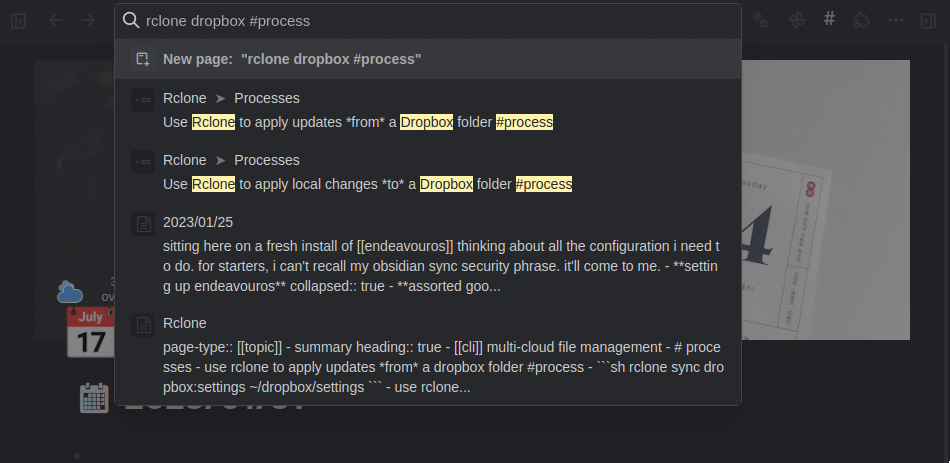

+++
title = "Emulate tldr instead of man in your notes"
date = "2023-01-31"
draft = false

[taxonomies]
category = [ "note",]
tags = [ "logseq", "second brain",]

[extra]
card = "social_card.webp"

[extra.cover_image]
path = "2023-01-31-rclone-entry.png"
caption = "A bullet point is a note given the right tag"

+++


Emulate [`tldr`][tldr-tar] instead of [`man`][man-tar] in your notes.

[tldr-tar]: https://tldr.ostera.io/tar
[man-tar]: https://man7.org/linux/man-pages/man1/tar.1.html



I still use my PKMs wrong.
Keep your notes small.
Stick with one tool.
Stay focused.
Yep, none of that.

But I *have* learned that emulating man page style isn't great.
I have big notes on commands with every option, every subcommand, and every
subcommand's option.

Then I'd end up searching online how to do a thing.
Because I wasn't using a searchable style.

Few months ago I had a moment of enlightenment.
Most of what I want in my knowledge garden is to track *processes* —
how to do a specific thing.
Why not make the notes reflect that?

Use clear language directly relevant to the task at hand.
Tag them appropriately with a key tag like "process".
You do end up with a lot of notes —
or a lot of bullet points, if you use an outliner like [Logseq][logseq].

[Logseq]: https://logseq.com

```markdown
- Use Rclone to pull *from* a Dropbox folder #process
	- ```sh
	  rclone sync dropbox:Settings ~/Dropbox/Settings
	  ```
- Use Rclone to push *to* a Dropbox folder #process
	- ```sh
	  rclone sync ~/Dropbox/Settings dropbox:Settings
	  ```
```

But they will be easier to find a few months later when all you can remember
is "something something [Rclone][rclone] [Dropbox][dropbox]".

[rclone]: https://rclone.org/
[dropbox]: https://dropbox.com/



I had these particular processes in the main page for Rclone, but most are scattered throughout my journal pages.
It makes no difference, since I use the tag consistently.