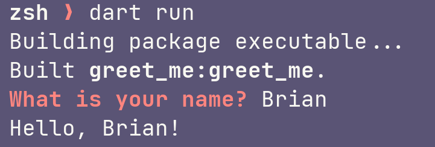

I haven't played with [Dart](https://dart.dev) since – oh, I don't know, 2013 or so. It was nice, but nothing felt compelling compared to the languages I already used. I stopped hearing about Dart when I stopped using Google+.

Nowadays, Dart is a bit more interesting.

The language itself has evolved, of course. So have all the other languages. What's interesting is that Dart powers [Flutter](https://flutter.dev), Google's cross-platform application development framework. You can write Flutter applications for Windows, macOS, Linux, iOS, Android, and oh yeah Web frontends.

That's pretty dang cool.

I want to look at the Dart language itself – figure out how to use it for basic command line applications before I confuse myself with multi-platform GUI development.

## Writing a Dart script

I start exploring a new or forgotten language by answering a few questions:

* How do I print something out in a terminal?
* How do I get user input in a terminal?
* How do I print variables such as user input?

There are nearly always multiple answers to each, but here's a start.

```dart{title="greet_me.dart"}
import 'dart:io';

void main() {
  print('What is your name?');
  final name = stdin.readLineSync();
  print('Hello, $name!');
}
```

The basic answers to my basic questions:

* [dart:io](https://api.dart.dev/stable/2.18.7/dart-io/dart-io-library.html) gives us handles for standard output, standard error, and standard input
* `print()` prints a string of text on its own line
* [Stdin.readLineSync()](https://api.dart.dev/stable/2.18.7/dart-io/Stdin/readLineSync.html) gets us a line of input from the user
* Dart strings support variable interpolation

The big question though is how do I even run the dang thing

### Running my Dart script

```console
$ dart run greet_me.dart
What is your name?
Brian
Hello, Brian!
```

I *could* give it a `#!/usr/bin/env`​ shebang line at the top and `chmod 755 hello.dart`​. Then I'd have a nice traditional script executable on any machine with the Dart runtime. But there's a better way, and that starts with using the Dart compiler.

### Using the Dart compiler

Compiling this Dart code into an executable for my current machine takes one line.

```console
$ dart compile exe greet_me.dart
Info: Compiling with sound null safety
Generated: /Users/random/Projects/dart/running_dart_code/script/greet_me.exe
```

Dart's executable compilation adds an `.exe`​ extension to the output file regardless of platforn by default. That extension doesn't matter to macOS or Linux – a filename is just a filename on those platforms – but I dislike seeing a `.exe`​ anywhere but on Windows.

```console
$ dart compile exe greet_me.dart -o greet_me
Info: Compiling with sound null safety
Generated: /Users/random/Projects/dart/running_dart_code/script/greet_me
```

Anyways! I have an executable file. I can run it.

```console
$ ./greet_me
What is your name?
Brian
Hello, Brian!
```

I can put that on any macOS device and run it without installing Dart on it. Of course, I only have one macOS device, and it has Dart installed on it. But the *idea* is the important part.

And the idea here is a simpler one: the same commands will compile the same code, regardless of what machine I'm on. I wrote most of this post on a Windows desktop. I edited and fine-tuned on an Apple laptop. The code worked as-is. The only invocation change I made was the `-o`​ option for personal taste.

{}
Dart cannot cross-compile for other platforms yet. Compiling an executable on Windows gets you a Windows executable. But `dart compile`​ [subcommands](https://dart.dev/tools/dart-compile) provide multiple targets in a Dart context. Some will run on any device. Some can run without a Dart runtime.

| Subcommand    |Explanation|Run without Dart?|Multi-Platform?|
| ------------- | ------------------------------------------| -------------------| -----------------|
| `exe`         |standalone executable|yes|no|
| `jit-snapshot`|just-in-time snapshot with hot reloading|no|no|
| `aot-snapshot`|ahead-of-time snapshot|no|no|
| `kernel`      |intermediate representation of code|no|yes|
| `js`          |JavaScript [^1]|yes|yes|

 [^1]: use [webdev](https://dart.dev/tools/webdev) instead for JS targets

Oh, and trivia: `dart run greet_me.dart` compiles a JIT snapshot in the background and runs that.
{}

Next problem: I'm coming in from Python and [Rich](https://rich.readthedocs.io/en/stable/text.html) for CLI applications. That name prompt should look so much better. I'm not ready to port Rich and Textual to Dart just yet. Maybe somebody has put some kind of console prompt handler on [pub.dev](https://pub.dev), the Dart package repository?

Looks like [DCli](https://dcli.onepub.dev) has what I'm looking for today, and functions for stuff I want to do later as well. Let's try it out!

Time to move from a standalone script file to a project, so I can more easily manage dependencies.

## Building a Dart Project

[`dart create`](https://dart.dev/tools/dart-create) generates a project scaffold. It needs at least a project name. By default it creates what you need for a command line application, and those defaults are exactly what I need today. More than I need today, really.

```text
$ dart create greet_me
Creating greet_me using template console...

  .gitignore
  analysis_options.yaml
  CHANGELOG.md
  pubspec.yaml
  README.md
  bin/greet_me.dart
  lib/greet_me.dart
  test/greet_me_test.dart

Running pub get...
  ...
  Changed 46 dependencies!

Created project greet_me in greet_me! In order to get started, run the following commands:

  cd greet_me
  dart run
```

There's a lot going on in there, most of which I ignore in my dedicated pursuit of "running some Dart code."

### Add a project dependency

The [`dart pub`](https://dart.dev/tools/pub/cmd) commands handle dependency management and publishing your project to Pub. So let's use that to add Dcli as a dependency.

```sh
dart pub add dcli
```

Since this is a `pub`​ command, it does not surprise me that this dependency detail has been added to `pubspec.yaml`​. That's where I'll find most information *about* the project.

```yaml{title="greet_me/pubspec.yaml"}
name: greet_me
description: A sample command-line application.
version: 1.0.0
# homepage: https://www.example.com

environment:
  sdk: '>=2.18.6 <3.0.0'

dev_dependencies:
  lints: ^2.0.0
  test: ^1.16.0
dependencies:
  dcli: ^1.36.0
```

Back to the code! I'll write a cute little greeter function in `lib/greet_me.dart`​ which adds a lightly formatted prompt to my name request.

```dart{title="greet_me/lib/greet_me.dart"}
import 'package:dcli/dcli.dart';

void greetMe() {
  final prompt = red('What is your name?');
  final name = ask(prompt);
  print('Hello, $name!');
}
```

 I can just have `main`​ use that greeter function. When I start thinking in terms of projects rather than scripts, I tend to make the application entrypoint minimal, with the logic out in project library files where they're easier to test.

```dart{title="greet_me/bin/greet_me.dart"}
import 'package:greet_me/greet_me.dart';

void main(List<String> arguments) => greetMe();
```

Not that I'm writing any test code today.

### Run the project application

​`dart run`​ works without arguments here, probably because I only have a single file with `main()`​ defined.

```console
$ dart run
Building package executable...
Built greet_me:greet_me.
What is your name? Brian
Hello, Brian!
```

Neat. Okay there's not much in a straight paste of output. Here's a screenshot, so you can see the visual effect from `red()`​.



That's better than what I had. 

### Compile the project application

What if I want to compile it? That's pretty much the same process as with the script. Dart doesn't make any assumptions about files when it comes to compiling an executable.

```sh
dart compile exe bin/greet_me.dart -o ./greet_me
```

I'm sure there's some kind of build tool out there to simplify the process, but my knowledge hasn't gotten that far yet. Until then, this invocation could be put in a [justfile](https://just.systems/man/en/)``​ for my normal project flow.

## What now?

I'm still early in my exploration of Dart and Flutter, learning not just what Dart code looks like but what it *should* look like. I may add some notes about linting and code analysis tools later. I'm sure to explore DCli, which has a wealth of functions relevant to command line utility scripts. And I definitely want to learn more about how big cross-platform Dart projects are handled.

Meanwhile, I need to see more of the Dart world.

* connect to some Dart [community resources](https://dart.dev/community)
* check out the [Awesome Dart](https://github.com/yissachar/awesome-dart) repository to see cool things other folks do with the language

